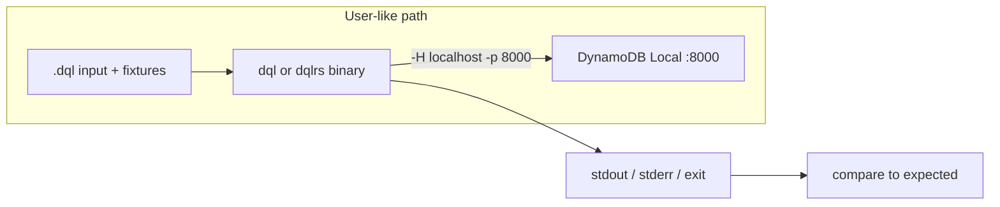

# Black-box acceptance tests under `manual-tests/`

## Why this exists

In-tree tests today know too much about the implementations:

- Python pytest (`py-impl/tests/`) imports `dql`, patches CloudWatch, and calls `DQLClient` / `Engine` in-process.
- Rust crate tests (`rust-impl/crates/*/tests/`) import parser, engine, and CLI libraries.
- `scripts/rust-smoke-test.sh` is the closest user-like check, but it is a single script, not a place to add cases.

`manual-tests/` is already documented as language-agnostic DQL fixtures (`README.md`). It currently has two ad-hoc folders (`fake-users/`, `update-gsi-fails/`) and no runner. This plan turns that directory into the **acceptance** layer: additional cases that a user could perform with only the installed binaries and DynamoDB Local.

These tests must not import, link, or otherwise know about `py-impl/` or `rust-impl/` source. They treat `dql` and `dqlrs` as opaque programs.



## Current state

| Path | Role today |
| --- | --- |
| [`manual-tests/fake-users/`](manual-tests/fake-users/) | Sample `CREATE` / `ALTER` / `LOAD` script plus JSON; generator uses `dynamo3` (not black-box) |
| [`manual-tests/update-gsi-fails/`](manual-tests/update-gsi-fails/) | DynamoDB Local GSI bug repro via AWS CLI, not DQL |
| [`scripts/install_dynamodb_local.sh`](scripts/install_dynamodb_local.sh) | Download jar, start Local in-memory shared DB on 8000 |
| [`scripts/rust-smoke-test.sh`](scripts/rust-smoke-test.sh) | One-shot `dqlrs -c` / `--json` / `-H` smoke |
| Python/Rust unit + Local tests | Implementation-aware; stay where they are |

User-visible invocation (both binaries, same flags):

```bash
dql   -H localhost -p 8000 --json -c "SELECT * FROM t WHERE id = 'a';"
dqlrs -H localhost -p 8000 --json -c "SELECT * FROM t WHERE id = 'a';"
```

REPL `file path.dql` also exists in both. Piped interactive shells are **not** a reliable shared surface: Python `cmd.Cmd` can read stdin; Rust uses a TUI REPL. Acceptance cases should prefer `-c` and `file`, not raw TTY interaction.

## Goal

1. Add a **folder-per-case** layout under `manual-tests/` so new acceptance tests are copy-paste of an existing case.
2. Provide a **harness** that:
   - Requires DynamoDB Local on `localhost:8000` (same as [`VERIFICATION.md`](VERIFICATION.md)).
   - Discovers `dql` and/or `dqlrs` from `PATH` (or `DQL_BIN` / `DQLRS_BIN`).
   - Loads schema/data the way a user would (`CREATE` / `INSERT` / `LOAD`, optionally AWS CLI).
   - Runs commands through the CLI and asserts stdout, stderr, and exit code.
3. Keep the suite **implementation-blind**: no Python `import dql`, no Rust crate deps, no reading `py-impl/` or `rust-impl/` at runtime.
4. Run the **same cases** against both binaries when both are installed, so this suite is also a user-level parity gate.

## Design decisions

### Black-box contract

Allowed in `manual-tests/` (new code):

- Shell, Python **stdlib only**, or AWS CLI talking to Local.
- DQL language files (`.dql`), JSON/CSV fixtures, expected-output files.
- Calling `dql` / `dqlrs` as subprocesses.

Forbidden:

- `import dql`, `from dql …`, `use dql_*`, cargo/pytest of implementation packages.
- Patching internals (CloudWatch, engine, parser).
- Asserting on private types, AST, or SDK request objects.
- `DQL_BACKEND=memory` as the default path (that is not how a user talks to Local). Memory backend may be used only in an explicit `cli/` case that documents the env var.

Credentials for Local: `AWS_ACCESS_KEY_ID` / `AWS_SECRET_ACCESS_KEY` set to dummy values, matching how people run Local today.

### Assert JSON, not pretty tables

Pretty `smart` / `rich` / `column` output differs by terminal width (Python CI already has snapshot width issues). Acceptance cases that check query results should use `--json` and compare parsed JSON (order-insensitive object keys; arrays as returned).

Optional `expected.stdout` is for messages such as “created table”, version strings, or help text where JSON is not produced.

### Unique table names

Harness substitutes `{{TABLE}}` (and `{{TABLE2}}` …) in `.dql` / expected files with `at_<slug>_<pid>_<n>` so cases can share one Local process without colliding. Cases must not hard-code production-like names unless they are self-contained and drop the table in teardown.

### Keep existing ad-hoc folders

Do not rewrite `fake-users/` or `update-gsi-fails/` in the first pass. Document them as **ad-hoc / repro** material. New cases must not copy the `dynamo3` generator pattern.

## Target layout

```text
manual-tests/
  README.md                 # how to run; black-box rules
  harness/
    run.sh                  # entry: ./harness/run.sh [filter] [--bin dql|dqlrs|both]
    lib.sh                  # wait-for-local, invoke, table names
    compare.py              # stdlib JSON/text compare (no dql import)
  fixtures/                 # shared datasets reused by several cases
    posts/
      posts.json            # JSON-lines or DQL LOAD format
    users/
      users.json
  cases/
    create/                 # one subfolder per case
    insert/
    select/
    scan/
    update/
    delete/
    alter/
    drop/
    load/
    dump/
    explain/
    analyze/
    cli/                    # flags, --version, --json, local connect, file
    journeys/               # multi-statement user stories
  fake-users/               # existing; unchanged
  update-gsi-fails/         # existing; unchanged
```

Family folders match the documented statement list in [`rust-docs/README.md`](rust-docs/README.md) and [`py-docs/topics/queries/`](py-docs/topics/queries/). Empty families still get a `.gitkeep` (or a `README.md` listing intended cases) so people know where to add files.

### Case folder convention

Each case is a directory `cases/<family>/<slug>/`:

| File | Required | Meaning |
| --- | --- | --- |
| `README.md` | no | What a user is proving |
| `setup.dql` | no | `CREATE` / `INSERT` / `LOAD` run before the asserted commands |
| `seed.json` | no | Fixture loaded with `LOAD seed.json INTO {{TABLE}}` if `setup.dql` references it |
| `input.dql` | yes | Commands whose output is asserted (the “user types this”) |
| `teardown.dql` | no | Default if missing: `DROP TABLE {{TABLE}}` (and `{{TABLE2}}` …) |
| `expected.json` | one of json/stdout | Parsed JSON from `--json` stdout |
| `expected.stdout` | one of json/stdout | Exact or glob text when JSON is the wrong oracle |
| `expected.stderr` | no | Substring or empty |
| `expected.exit` | no | Integer, default `0` |
| `mode` | no | File containing `oneshot` (default), `file`, or `repl-stdin` |

**`oneshot` (default):** concatenate `setup.dql` + `input.dql` into one `-c` string with `-H localhost -p 8000 --json` (omit `--json` if the case only has `expected.stdout`).

**`file`:** write a temp `.dql` and run `-c "file <tmp>"` — covers the same path a user uses for scripts.

**`repl-stdin`:** pipe lines into the process without `-c`. Mark Python-only until Rust REPL is scriptable; harness should skip with a clear reason rather than fail `dqlrs`.

Relative paths in `LOAD` / `SAVE` / `file` are resolved from the **case directory** (the harness `cd`s there).

### Example case

`cases/select/hash-key/`:

```sql
-- setup.dql
CREATE TABLE {{TABLE}} (id STRING HASH KEY, n NUMBER);
INSERT INTO {{TABLE}} (id, n) VALUES ('a', 1), ('b', 2);
```

```sql
-- input.dql
SELECT * FROM {{TABLE}} WHERE id = 'a';
```

```json
[{"id": "a", "n": 1}]
```

Harness:

```bash
"$DQL_BIN" -H localhost -p 8000 --json -c "$setup $input"
```

Then JSON-equals `expected.json` (possibly wrapped in extra CLI noise — comparer should extract JSON array/object from stdout).

### First seed cases (step 4)

Enough to prove the convention, not a port of all `test_queries.py`:

1. **`journeys/getting-started-posts`** — `CREATE` / `INSERT` / `ls` / `SELECT` / `SCAN` from [`py-docs/topics/getting_started.rst`](py-docs/topics/getting_started.rst). Assert SELECT JSON; `ls` via `expected.stdout` substring (`posts` / table name).
2. **`select/hash-key`** — hash-key query, JSON items.
3. **`load/json-into-table`** — `CREATE`, `LOAD fixtures/…json`, `SELECT`/`SCAN` count or items.

Later cases can follow `py-impl/tests/test_queries.py` class names (create indexes, update SET/ADD/REMOVE, delete WHERE, explain) **without copying test code** — only the user-visible statements and results.

## Harness behavior

[`manual-tests/harness/run.sh`](manual-tests/harness/run.sh):

```bash
./manual-tests/harness/run.sh                  # both binaries if found
./manual-tests/harness/run.sh select           # family or slug filter
./manual-tests/harness/run.sh --bin dqlrs
```

Steps:

1. Fail fast if Local is down (`nc -z localhost 8000`), with a pointer to `./scripts/install_dynamodb_local.sh`.
2. Resolve binaries: `DQL_BIN` / `DQLRS_BIN`, else `command -v dql` / `dqlrs`.
3. For each matching case × selected binary: substitute tables, run setup+input, compare, teardown (always, even on failure).
4. Print a per-case pass/fail line and a summary. Exit non-zero if any case failed or no binary was found when `--bin` was explicit.

Do **not** start Java from the harness by default (Local is long-lived in this repo’s workflow). Optional `--start-local` can call `scripts/install_dynamodb_local.sh background` for CI.

Isolation: set `HOME` / `XDG_CONFIG_HOME` to a temp dir so `~/.config/dql.json` and history from the developer machine cannot leak into results.

## What this is not

- A replacement for parser/engine unit tests.
- Pixel-identical REPL prompts, pager/`less`, or ratatui layout tests.
- Live AWS account tests (Local only).
- Automatically porting every pytest case in the first implementation.

Python `test_cli.py` width/snapshot failures are exactly why pretty-print oracles stay out of this suite.

## Implementation steps

### Step 1 — Contract README

Write [`manual-tests/README.md`](manual-tests/README.md): purpose, allowed tools, how to start Local, how to install/find binaries, how to add a case, how to run the harness. One short “do not import DQL” rule at the top.

**Commit:** `docs(manual-tests): black-box acceptance test contract`

### Step 2 — Folder skeleton

Create `harness/`, `fixtures/`, `cases/<family>/` with `.gitkeep` or family README stubs. Do not delete `fake-users/` or `update-gsi-fails/`.

**Commit:** `chore(manual-tests): add acceptance case folder skeleton`

### Step 3 — Harness

Implement `harness/run.sh` + `harness/compare.py` (or a single bash script if JSON compare stays trivial). Stdlib only. Cover missing Local, missing binary, JSON match, JSON mismatch, teardown on failure.

**Gate:** a deliberately wrong expected file fails; a matching seed case passes against at least one binary.

**Commit:** `test(manual-tests): add black-box CLI harness for DynamoDB Local`

### Step 4 — Seed cases

Add the three cases above plus a small fixture file. Use `{{TABLE}}` everywhere.

**Gate:** `./manual-tests/harness/run.sh --bin dql` and `--bin dqlrs` both pass with Local up (skip a binary only if it is not installed, unless `--bin` named it).

**Commit:** `test(manual-tests): add getting-started, select, and load seed cases`

### Step 5 — Pointers, leave ad-hoc tests

- Add a subsection to [`rust-plans/testing-strategy.md`](rust-plans/testing-strategy.md): “Black-box acceptance (`manual-tests/`)” distinct from crate Local tests.
- Add a “Acceptance (binaries + Local)” snippet to [`VERIFICATION.md`](VERIFICATION.md).
- In `manual-tests/README.md`, label `fake-users/` and `update-gsi-fails/` as ad-hoc.

**Commit:** `docs: point verification at black-box acceptance suite`

### Step 6 — Optional CI (follow-up)

New workflow or job: install Java, start Local, `uv tool install` Python dql and/or `cargo build -p dql-cli`, run harness with `--bin both`. Path filter `manual-tests/**`. Not required to land the folder convention.

## Risk mitigations

| Risk | Mitigation |
| --- | --- |
| Pretty output differs across binaries/terminals | `--json` as the default oracle |
| Shared Local pollutes tables | Unique `{{TABLE}}` + teardown |
| Rust REPL is a TUI | Default `oneshot` / `file`; skip `repl-stdin` for `dqlrs` |
| LOAD pickle vs MessagePack | Seed fixtures as JSON (or CSV); do not check in `.p` files |
| GSI ALTER broken on Local | Keep that scenario in `update-gsi-fails/`; do not make it a required gate |
| Accidental imports of DQL | README contract + harness review; no pytest plugin that imports `dql` |

## Out of scope for the first pass

- Filling every family with exhaustive cases (skeleton + seeds only).
- Rewriting `fake-users/convert.py` off `dynamo3`.
- TUI / pager / CloudWatch `watch` / `ls metrics` acceptance.
- Changing Python or Rust product code except docs pointers.
