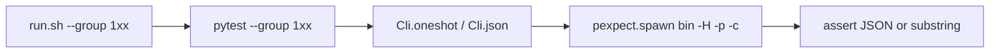
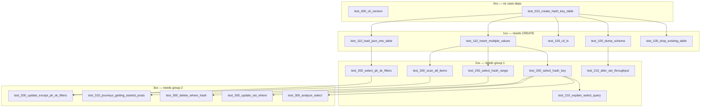

# Pytest + pexpect black-box suite

Drop the generic folder interpreter. A test is a Python function that drives `dql` / `dqlrs` through a small `Cli` helper (`pexpect.spawn` of `-c`). Keep the **diagnostic numbering** so a failing `010` still means “do not trust 1xx.”



## Layout

```text
black-box-tests/
  pyproject.toml
  README.md
  ordering.md                 # moved from cases/; same graph and rules
  run.sh                      # thin wrapper; keeps today’s flags
  conftest.py                 # Local, binaries, --bin, --group, Cli fixture
  cli.py                      # pexpect spawn + unique tables
  compare.py                  # JSON/stdout helpers (from harness/compare.py)
  fixtures/
    pk-sk-records/            # 1000-row LOAD (unchanged)
    load-users/seed.json      # from 110-load-json-into-table/seed.json
  tests/
    test_000_cli_version.py
    test_010_create_hash_key_table.py
    test_100_drop_existing_table.py
    test_100_dump_schema.py
    test_100_cli_ls.py
    test_110_insert_multiple_values.py
    test_110_load_json_into_table.py
    test_200_select_hash_key.py
    test_200_select_hash_range.py
    test_200_select_pk_sk_filters.py
    test_200_scan_all_items.py
    test_210_alter_set_throughput.py
    test_210_explain_select_query.py
    test_300_analyze_select.py
    test_300_update_set_where.py
    test_300_update_except_pk_sk_filters.py
    test_300_delete_where_hash.py
    test_310_journeys_getting_started_posts.py
  manual-cases/               # unchanged, not collected
```

Delete [`black-box-tests/cases/`](black-box-tests/cases/) and the bash runner ([`harness/run.sh`](black-box-tests/harness/run.sh), [`lib.sh`](black-box-tests/harness/lib.sh)). Leave [`manual-cases/`](black-box-tests/manual-cases/) alone.

Black-box rule unchanged: **no `import dql`**. Deps are pytest + pexpect only.

## Diagnostic grouping

Same rules as [`black-box-tests/cases/ordering.md`](black-box-tests/cases/ordering.md): numbers are **diagnostic dependencies**, not shared DynamoDB state. Each test still gets unique table names and its own setup/teardown.

- Test **file and function** keep the three-digit prefix: `test_110_insert_multiple_values`.
- Collection order is `LC_ALL=C` sort of those names (pytest default = filename order), matching today’s case order.
- `--group` uses the **same digit-wildcard filter** as `run.sh` does now (`1xx`, `11x`, `2xx` match the `NNN` in `test_NNN_…`). Non-numeric leftover args stay a substring of the test name (`create`, `select`).

[`run.sh`](black-box-tests/run.sh) (suite root, not `harness/`):

```bash
./black-box-tests/run.sh
./black-box-tests/run.sh 1xx
./black-box-tests/run.sh --bin dqlrs
./black-box-tests/run.sh --start-local
./black-box-tests/run.sh --skip-teardown
./black-box-tests/run.sh -v
```

Implementation: `uv run --project black-box-tests pytest --bin … --group …`. Document the pytest equivalents in the README (`pytest --group 1xx -k insert`).

Do not encode pytest-dependency plugins. Groups are documentation + filter only, as today.



Move [`cases/ordering.md`](black-box-tests/cases/ordering.md) to [`black-box-tests/ordering.md`](black-box-tests/ordering.md) and retarget names from folders to `test_NNN_*`. Keep the cycle-breaking table (CREATE may INSERT+SELECT only as a check).

## Cli helper

[`black-box-tests/cli.py`](black-box-tests/cli.py) + fixtures in [`conftest.py`](black-box-tests/conftest.py):

- Parametrize every test over `dql` and `dqlrs` (`--bin dql|dqlrs|both`, default both; skip a missing binary unless `--bin` named it).
- `cli.table()` → unique `at_<NNN>_<slug>_<bin>_<n>_<pid>` (same collision rules as [`lib.sh` `table_name`](black-box-tests/harness/lib.sh)).
- `cli.oneshot(dql)` — `pexpect.spawn([bin, -H, -p, -r, -c, script])`, wait `EOF`, return stdout + exitstatus.
- `cli.json(dql)` — same with `--json`, then [`parse_cli_json` / `json_equal`](black-box-tests/harness/compare.py).
- Teardown fixture: `DROP TABLE` for names from `cli.table()` unless `--skip-teardown`.
- Isolated `HOME` / `XDG_CONFIG_HOME`; env `NO_COLOR=1`, `PAGER=cat`, `COLUMNS=120`, `LINES=40`; dummy AWS keys; unset `DQL_BACKEND`.
- Spawn: `echo=False`, `encoding="utf-8"`, `dimensions=(40, 120)`, timeout ~120s. Strip ANSI before asserts.
- `--start-local` / require Local on `DQL_LOCAL_HOST`:`DQL_LOCAL_PORT` (default `localhost:8000`), same as today.

JSON cases use `--json` (works on a TTY for both CLIs). Stdout cases assert substring / collapsed-whitespace, same as `stdout_matches`. If PTY wrapping breaks a text oracle, change the assert in that test only.

Do **not** port `10-mode` / `file` / `repl-stdin`. None of the 18 cases use them. A later REPL test would be another pytest function (`spawn` without `-c`, `dql` only).

## Port map (1:1)

Each function inlines the current setup + test DQL; asserts match today’s expected files. Relative `LOAD` paths resolve from the suite root or `cwd=fixtures/…`.

- `test_000_cli_version` — `version`; `"0.6.4"` in stdout; no table.
- `test_010_create_hash_key_table` — CREATE + INSERT + SELECT; JSON `[{"id": "ok"}]`.
- `test_100_drop_existing_table` — CREATE then DROP; `"Dropped table"`.
- `test_100_dump_schema` — CREATE then DUMP SCHEMA; `"(2, 3)"` substring.
- `test_100_cli_ls` — CREATE then `ls`; table name in stdout.
- `test_110_insert_multiple_values` — CREATE; INSERT two rows; SELECT `b` → `[{"id":"b","n":2}]`.
- `test_110_load_json_into_table` — CREATE; LOAD `fixtures/load-users/seed.json`; SELECT `u1`.
- `test_200_select_hash_key` / `_hash_range` / `_scan_all_items` — same DQL/JSON as current folders.
- `test_200_select_pk_sk_filters` — LOAD [`fixtures/pk-sk-records/seed.json`](black-box-tests/fixtures/pk-sk-records/seed.json).
- `test_210_alter_set_throughput` / `test_210_explain_select_query` — stdout oracles.
- `test_300_analyze_select` / `_update_set_where` / `_delete_where_hash` — JSON as today.
- `test_300_update_except_pk_sk_filters` — same 1000-row fixture; stdout `998`.
- `test_310_journeys_getting_started_posts` — CREATE+INSERT+SELECT steve’s posts.

`000`’s current teardown is `ls` (not DROP). New tests with no table skip DROP; tests that create tables always DROP in the fixture.

## Docs

Rewrite [`black-box-tests/README.md`](black-box-tests/README.md): pytest + pexpect, `Cli` helper, `test_NNN_*` naming, `--group`, no case-folder contract, pexpect allowed, still no `import dql`.

Point [`VERIFICATION.md`](VERIFICATION.md) and [`rust-plans/testing-strategy.md`](rust-plans/testing-strategy.md) at `./black-box-tests/run.sh` (and `--group 1xx`). Update [`fixtures/pk-sk-records/README.md`](black-box-tests/fixtures/pk-sk-records/README.md) to the new test names.

## Verify

```bash
export DQL_BIN="$PWD/py-impl/.venv/bin/dql"
export DQLRS_BIN="$PWD/rust-impl/target/release/dqlrs"
./black-box-tests/run.sh
./black-box-tests/run.sh --bin dqlrs
./black-box-tests/run.sh --group 1xx -v
```

Gate: 18 tests × each present binary PASS (skip missing binary unless `--bin` requires it).

## Commits

Each work todo is followed by a **separate commit todo**. Do not start the next work item until that commit is done. Do not bundle work todos into one commit. Follow the repo’s commit-message style (why, 1–2 sentences).

- After **pyproject** → **commit-pyproject**: `test(black-box-tests): add pytest+pexpect project skeleton and run.sh`
- After **cli-helper** → **commit-cli-helper**: `test(black-box-tests): add Cli helper and conftest for Local and both binaries`
- After **port-tests** → **commit-port-tests**: `test(black-box-tests): replace case folders with test_NNN pytest modules`
- After **docs** → **commit-docs**: `docs(black-box-tests): document pytest harness and diagnostic groups`
- After **verify** → **commit-verify**: `fix(black-box-tests): stabilize PTY stdout oracles` — skip if nothing changed
