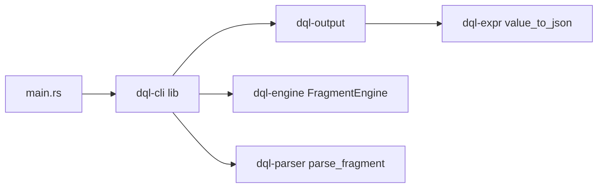

# Phase 5: CLI, REPL, and Output

## Current state

[`crates/dql-cli/src/main.rs`](rust-impl/crates/dql-cli/src/main.rs) is a 200-line monolith with hand-parsed flags, a stdin multiline loop (semicolon-only, `exit` only), and direct `StatementResult` printing. Phases 1–4 are done in parser/expr/models/engine; Phase 5 parity tests exist but are mostly `#[ignore]` in [`crates/dql-cli/tests/python_cli_history_parity.rs`](rust-impl/crates/dql-cli/tests/python_cli_history_parity.rs).

Python reference: [`dql/cli.py`](dql/cli.py), [`dql/output.py`](dql/output.py), [`dql/history.py`](dql/history.py), [`dql/help.py`](dql/help.py), [`dql/engine.py`](dql/engine.py) (`FragmentEngine`).

Target layout (from [`rust-plans/architecture.md`](rust-plans/architecture.md)):



## Design decisions

- **Split `dql-cli` into `lib.rs` + thin `main.rs`** so meta-commands, config, and REPL are testable without spawning the binary.
- **Add `dql-output` crate** for all formatters and display backends; keep one-shot `-c` output on stdout (pipe-friendly).
- **Add `FragmentEngine` to `dql-engine`** (not CLI-only) so deferred engine parity tests can be enabled.
- **Interactive mode uses `ratatui` + `crossterm`**; non-interactive `-c` stays plain stdout (no TUI takeover).
- **`watch` and `rich` format** ship last, behind an optional `watch` Cargo feature using `aws-sdk-cloudwatch`, per roadmap risk note.
- **Preserve current defaults**: `AWS_REGION` → `us-west-1`, memory backend when no `-H`, JSON via `--json` on `-c`.

## Implementation steps (one commit each)

### Step 1 — Scaffold `dql-output` and `clap` CLI foundation

**Files**
- Create [`crates/dql-output/`](rust-impl/crates/dql-output/) with `Cargo.toml`, `src/lib.rs`
- Add workspace member in [`rust-impl/Cargo.toml`](rust-impl/Cargo.toml)
- Refactor [`crates/dql-cli/`](rust-impl/crates/dql-cli/): `lib.rs`, `args.rs`, slim `main.rs`

**Work**
- Replace hand-parsed `Args` with `clap` mirroring Python [`dql/__init__.py`](dql/__init__.py): `-c`, `-r`, `-H`, `-p`, `--json`, `--version`, `--help`
- Introduce `CliConfig` / `SessionOptions` struct matching Python `DEFAULT_CONFIG`:

```rust
// width, pagesize, display, format, allow_select_scan, lossy_json_float
```

- Move JSON rendering into `dql-output::JsonFormat` (reuse [`dql-engine/src/json_util.rs`](rust-impl/crates/dql-engine/src/json_util.rs) via public re-export or shared helper)
- `-c --json`: force `pagesize = 0`, `format = json`, suppress status strings (match Python `run_command`)

**Gate**: existing `current_cli_surface` tests still pass.

**Commit**: `feat(cli): add dql-output crate and clap-based argument parsing`

---

### Step 2 — `FragmentEngine` and improved one-shot execution

**Files**
- Add [`crates/dql-engine/src/fragment.rs`](rust-impl/crates/dql-engine/src/fragment.rs)
- Export from [`crates/dql-engine/src/lib.rs`](rust-impl/crates/dql-engine/src/lib.rs)
- Wire in `dql-cli`

**Work**
- Port Python `FragmentEngine` behavior using existing `dql_parser::parse_fragment`:
  - accumulate fragments until `FragmentStatus::Complete`
  - execute complete script, return `None` while incomplete
  - `reset()` after REPL command loop iteration
  - `pformat_exc()` for parse error caret display
- `-c` path: if command leaves a partial fragment, auto-run `;` (Python [`__init__.py`](dql/__init__.py) lines 76–77)
- Replace naive semicolon REPL buffer with `FragmentEngine` (still stdin-based for now)

**Gate**: un-ignore and pass the 5 `TestFragmentEngine` tests in [`python_engine_query_model_parity.rs`](rust-impl/crates/dql-engine/tests/python_engine_query_model_parity.rs).

**Commit**: `feat(engine): add FragmentEngine for multiline input`

---

### Step 3 — Persistent config and `opt` meta-command

**Files**
- [`crates/dql-cli/src/config.rs`](rust-impl/crates/dql-cli/src/config.rs)
- [`crates/dql-cli/src/meta/opt.rs`](rust-impl/crates/dql-cli/src/meta/opt.rs)

**Work**
- Load/save `~/.config/dql.json` (Python `save_config` / `load_config`)
- Implement `opt` get/set/list for: `width`, `pagesize`, `display`, `format`, `allow_select_scan`, `lossy_json_float`
- Wire `allow_select_scan` into `Engine::with_allow_select_scan`
- Add `repl_command` parser (port Python `repl_command` decorator using `shell-words` / `shlex` equivalent): positional args + `key=value` kwargs

**Gate**: enable `test_repl_command_args` and `test_repl_command_kwargs` in parity tests.

**Commit**: `feat(cli): add config persistence and opt meta-command`

---

### Step 4 — Meta-command router and lifecycle commands

**Files**
- [`crates/dql-cli/src/meta/mod.rs`](rust-impl/crates/dql-cli/src/meta/mod.rs) — dispatch table
- Individual handlers: `version`, `exit`, `clear`, `shell`, `whoami`

**Work**
- Route REPL input: meta-commands first (by name), else DQL via `FragmentEngine`
- Implement:
  - `version` — print crate version
  - `exit` / `EOF` (Ctrl-D) — write history (stub for now), exit cleanly
  - `clear` / `cls` / `c` — terminal clear + history item removal
  - `shell <cmd>` — `std::process::Command` with stdout/stderr merged
  - `whoami` / `iam` — session identity (STS `get_caller_identity` for SDK; `"local"` / `"memory"` for other backends)
- Preserve prompt behavior from current `print_prompt`: region line, `(host:port)` prefix, `   |` continuation

**Commit**: `feat(cli): add meta-command router and lifecycle commands`

---

### Step 5 — `use`, `local`, and `file` meta-commands

**Files**
- [`crates/dql-cli/src/session.rs`](rust-impl/crates/dql-cli/src/session.rs) — connection state
- [`crates/dql-cli/src/meta/connect.rs`](rust-impl/crates/dql-cli/src/meta/connect.rs)
- [`crates/dql-cli/src/meta/file.rs`](rust-impl/crates/dql-cli/src/meta/file.rs)

**Work**
- `use <region>` — reconnect `SdkBackend` (or no-op region label for memory backend)
- `local [host=… port=…]` / `local off` — toggle local endpoint, then re-run `use <region>`
- `file <path>` — read `.dql` file and execute via `_run_cmd` equivalent
- Region list for completion: hardcode Python `REGIONS` constant

**Commit**: `feat(cli): add use, local, and file meta-commands`

---

### Step 6 — Engine metadata helpers and `ls` command

**Files**
- Extend [`crates/dql-engine/src/engine.rs`](rust-impl/crates/dql-engine/src/engine.rs) or new `describe.rs`
- [`crates/dql-cli/src/meta/ls.rs`](rust-impl/crates/dql-cli/src/meta/ls.rs)
- [`crates/dql-output/src/table_meta.rs`](rust-impl/crates/dql-output/src/table_meta.rs)

**Work**
- Add to engine session state:
  - `cached_descriptions: HashMap<String, TableMeta>`
  - `describe(table, refresh, metrics)` and `describe_all(refresh)`
  - `list_tables()` passthrough
- `ls [pattern] [refresh=True] [metrics=True]`:
  - glob match via `glob` crate (Python `fnmatch`)
  - single match → detailed schema output
  - multiple → summary table (name, items, read/write throughput, status, size) using `humansize` / `human-panic` style formatting
- Text table output first (pipe-friendly); exact Rich styling not required for gate

**Gate**: enable `test_ls` and `test_ls_with_multiple_tables` with Rust `insta` snapshot files (capture once from memory backend; do not depend on Python syrupy snapshots).

**Commit**: `feat(cli): add ls meta-command and table metadata helpers`

---

### Step 7 — `TableLimits` and throttle meta-commands

**Files**
- Extend [`crates/dql-engine/src/throttle.rs`](rust-impl/crates/dql-engine/src/throttle.rs)
- [`crates/dql-cli/src/meta/throttle.rs`](rust-impl/crates/dql-cli/src/meta/throttle.rs)

**Work**
- Port Python [`dql/throttle.py`](dql/throttle.py) `TableLimits`:
  - `total`, `default`, per-table, per-index limits
  - percentage limits (`40%`) computed from table/index throughput
  - `save()` / `load()` JSON shape stored in config `_throttle`
- Before each DQL execute: `describe_all(false)` → build `RateLimit` → `engine.set_rate_limit(...)`
- `throttle` / `unthrottle` meta-commands with Python argument patterns; `unthrottle` confirmation via `promptyn` equivalent

**Commit**: `feat(cli): add throttle and unthrottle meta-commands`

---

### Step 8 — Output formats and pager display

**Files**
- [`crates/dql-output/src/formats/`](rust-impl/crates/dql-output/src/formats/) — `smart.rs`, `column.rs`, `expanded.rs`
- [`crates/dql-output/src/display.rs`](rust-impl/crates/dql-output/src/display.rs) — `stdout` and `less` backends

**Work**
- Port Python formatters from [`dql/output.py`](dql/output.py):
  - **JsonFormat** (done in step 1, refine `lossy_json_float`)
  - **ColumnFormat** — pipe table with width truncation
  - **ExpandedFormat** — key/value blocks
  - **SmartFormat** — pick column vs expanded based on terminal width
- Port `less_display` via temp file + `less -FXR` subprocess; `stdout_display` for `-c`
- Integrate with REPL result rendering: status strings for DDL, formatter for `StatementResult::Items`
- `-c` always uses stdout + configured format (default smart when not `--json`)

**Commit**: `feat(output): add smart, column, expanded formats and pager display`

---

### Step 9 — History manager and help text

**Files**
- [`crates/dql-cli/src/history.rs`](rust-impl/crates/dql-cli/src/history.rs)
- [`crates/dql-cli/src/help.rs`](rust-impl/crates/dql-cli/src/help.rs) — embed strings from [`dql/help.py`](dql/help.py)

**Work**
- Port `HistoryManager`:
  - `~/.dql/history` file
  - load on session start, append new entries on exit
  - `remove_items(n)` for clear/exit
  - swallow I/O errors (Python parity)
- `help` / `help <statement>` for ALTER, ANALYZE, CREATE, DELETE, DROP, DUMP, EXPLAIN, INSERT, LOAD, SCAN, SELECT, UPDATE, OPTIONS

**Gate**: enable all `test_history_manager` tests in parity file.

**Commit**: `feat(cli): add persistent history and statement help text`

---

### Step 10 — `ratatui` interactive REPL

**Files**
- [`crates/dql-cli/src/repl/mod.rs`](rust-impl/crates/dql-cli/src/repl/mod.rs)
- [`crates/dql-cli/src/repl/app.rs`](rust-impl/crates/dql-cli/src/repl/app.rs)
- [`crates/dql-cli/src/repl/widgets.rs`](rust-impl/crates/dql-cli/src/repl/widgets.rs)

**Dependencies**: `ratatui`, `crossterm`

**Work**
- Replace stdin `repl()` loop with ratatui application:
  - input line + multiline continuation indicator (`|`)
  - scrollable output pane for results and errors
  - Up/Down history navigation (backed by `HistoryManager` in-memory deque)
  - Tab completion for table names after `FROM` / `INTO` / `TABLE` / `UPDATE` / `DUMP` (use `engine.cached_descriptions`)
  - prompt shows `(host:port) region` like Python `update_prompt`
- On submit: route through meta-command dispatcher or `FragmentEngine`
- Ctrl-C: cancel partial fragment (reset engine), don't exit
- Ctrl-D / `exit`: clean shutdown + history write
- One-shot `-c` bypasses TUI entirely

**Commit**: `feat(cli): add ratatui interactive REPL with history and completion`

---

### Step 11 — Test parity, snapshots, and optional `watch`/`rich`

**Files**
- [`crates/dql-cli/tests/python_cli_history_parity.rs`](rust-impl/crates/dql-cli/tests/python_cli_history_parity.rs)
- [`crates/dql-cli/tests/snapshots/`](rust-impl/crates/dql-cli/tests/snapshots/) — `insta` golden files
- Optional: `crates/dql-cli/Cargo.toml` feature `watch`

**Work**
- Remove `#[ignore]` from all Phase 5 parity tests as each area lands; final pass enables `test_help_docs`
- Add `insta` snapshots for `test_scan_table`, `test_ls`, `test_ls_with_multiple_tables`
- Optional `watch` meta-command behind `--features watch`:
  - `aws-sdk-cloudwatch` metric polling
  - ratatui live view
- `rich` format: ratatui `Table` widget for interactive REPL results; fall back to column format in non-TUI contexts

**Gate** (Phase 5 compatibility gate from roadmap):
- `tests/test_cli.py` scenarios covered in Rust parity file
- `tests/test_history.py` covered
- Snapshot output for common one-shot and REPL flows

**Commit**: `test(cli): enable Phase 5 parity tests and output snapshots`

## Dependency additions (workspace-level)

| Crate | Purpose |
| --- | --- |
| `clap` | CLI args |
| `ratatui`, `crossterm` | Interactive REPL |
| `shell-words` | Meta-command arg parsing |
| `serde`, `serde_json` | Config/history persistence |
| `glob` | `ls` pattern matching |
| `humansize` | Table size formatting |
| `insta` (dev) | Output snapshots |
| `aws-sdk-sts` | `whoami` |
| `aws-sdk-cloudwatch` (optional) | `watch` |

## Risk mitigations

| Risk | Mitigation |
| --- | --- |
| TUI breaks pipe-friendly `-c` | Strict branch: TUI only when `command.is_none()` |
| `ls` Rich snapshot mismatch | Rust-specific `insta` snapshots on memory backend |
| `TableLimits` vs simple `RateLimit` | Port full `TableLimits` before enabling throttle tests |
| `watch` slows core work | Optional feature flag; stub message when disabled |
| Large `main.rs` refactor | Land lib split in Step 1 before feature work |

## Verification after each step

```bash
cd rust-impl
cargo fmt --check
cargo test --workspace
cargo run -p dql-cli -- --version
# After step 2+
cargo run -p dql-cli -- --json -c "CREATE TABLE t (id STRING HASH KEY); SCAN * FROM t"
# After step 10 (interactive smoke)
cargo run -p dql-cli -- -H localhost -p 8000
```

## Out of scope (Phase 6 / deferred engine gaps)

- Release packaging and install docs
- FragmentEngine-adjacent engine regressions (ORDER BY, reserved-word paths) — remain engine parity work, not CLI
- SAVE/gz/pickle LOAD formats
- Python `readline_compat` module registration test (no Rust equivalent needed)
