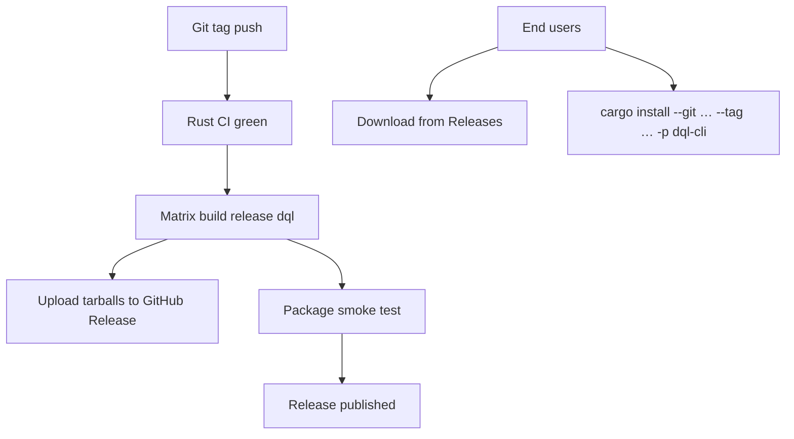

# Phase 6: Packaging and Release Path

## Current state

Phases 1–5 are implemented in `[rust-impl/](rust-impl/)`. The workspace already has six crates, a committed `[Cargo.lock](rust-impl/Cargo.lock)`, and a versioned `dql` binary (`0.6.4-dev12`, aligned with `[pyproject.toml](pyproject.toml)`). Phase 5 CLI/REPL work is complete per `[.cursor/plans/phase_5_cli_repl_1d33257c.plan.md](.cursor/plans/phase_5_cli_repl_1d33257c.plan.md)`.

**Gaps vs roadmap deliverables:**


| Deliverable             | Status                                                                                                  |
| ----------------------- | ------------------------------------------------------------------------------------------------------- |
| Locked workspace        | Done — verify freshness in CI                                                                           |
| Release binary config   | Missing — no `[profile.release]`                                                                        |
| Install docs            | Missing — `[README.rst](README.rst)` is pip/pex-only                                                    |
| Migration notes         | Missing                                                                                                 |
| Package smoke test gate | Missing                                                                                                 |
| Rust CI                 | Missing — `[.github/workflows/code-workflows.yml](.github/workflows/code-workflows.yml)` is Python-only |
| Published binaries      | Missing — commented-out Python `publish-job` still references `build/dql` pex                           |


**User decisions for this plan:**

- Release binaries: **Linux + macOS** (no Windows in Phase 6)
- Distribution: **GitHub release assets + `cargo install --git … --tag …`**

## Target release flow




## Design decisions

- **Binary name stays `dql`** — same as Python console script; crate name remains `dql-cli`.
- **Release profile in workspace root** — one `[profile.release]` in `[rust-impl/Cargo.toml](rust-impl/Cargo.toml)` applies to all crates.
- **Separate Rust workflow** — add `[rust-workflows.yml](.github/workflows/rust-workflows.yml)` rather than bloating the Python workflow; keep Python CI until Rust is declared primary.
- **Smoke test as integration test + CI step** — executable gate from roadmap, not just manual checklist in `[rust-plans/testing-strategy.md](rust-plans/testing-strategy.md)`.
- **Version bump stays unified** — extend `[scripts/bump-version.sh](scripts/bump-version.sh)` to include `rust-impl/Cargo.lock` after workspace version changes (alongside existing `uv.lock` sync).
- **Migration doc is explicit about gaps** — 7 remaining `#[ignore]` parity tests and deferred SAVE/gz/pickle LOAD (documented in `[rust-impl/README.md](rust-impl/README.md)` deferred section, needs refresh).
- **Config/history paths unchanged** — Rust already uses `~/.config/dql.json` and `~/.dql/history`; migration notes can say existing configs carry over.

## Implementation steps (one commit each)

### Step 1 — Release build hardening and toolchain pin

**Files**

- `[rust-impl/Cargo.toml](rust-impl/Cargo.toml)` — add workspace metadata + release profile
- `[rust-impl/rust-toolchain.toml](rust-impl/rust-toolchain.toml)` — pin stable channel
- `[rust-impl/.cargo/config.toml](rust-impl/.cargo/config.toml)` — optional: `strip = true` for release (or rely on profile)

**Work**

- Add `[workspace.package]` metadata: `description`, `authors`, `repository`, `homepage`, `readme`
- Add release profile (recommended starting point):

```toml
[profile.release]
lto = "thin"
codegen-units = 1
strip = true
panic = "abort"
```

- Pin stable Rust in `rust-toolchain.toml` (match CI)
- Mark library crates `publish = false`; keep `dql-cli` installable via git

**Gate:** `cargo build --release -p dql-cli` produces a stripped `target/release/dql`.

**Commit:** `build: add release profile and toolchain pin`

---

### Step 2 — Rust CI (fmt, clippy, test)

**Files**

- `[.github/workflows/rust-workflows.yml](.github/workflows/rust-workflows.yml)` (new)
- `[rust-impl/README.md](rust-impl/README.md)` — update CI badge reference

**Work**

- Trigger on push/PR to `v-rust`
- Jobs:
  1. **check** — `cargo fmt --check`, `cargo clippy --workspace --all-targets -- -D warnings`, lockfile freshness (`cargo generate-lockfile` + diff)
  2. **test** — `cargo test --workspace` on `ubuntu-latest` and `macos-latest`
  3. **DynamoDB Local** (ubuntu only) — reuse `[scripts/install_dynamodb_local.sh](scripts/install_dynamodb_local.sh)`, run `dynamodb_local_smoke` + `dynamodb_local_parity`
- Cache: `Swatinem/rust-cache` with `workspaces: rust-impl`

**Gate:** CI green on both OSes from clean checkout.

**Commit:** `ci: add Rust fmt, clippy, and test workflow`

---

### Step 3 — Package smoke test gate

**Files**

- `[rust-impl/crates/dql-cli/tests/package_smoke.rs](rust-impl/crates/dql-cli/tests/package_smoke.rs)` (new)
- `[rust-impl/scripts/smoke_test.sh](rust-impl/scripts/smoke_test.sh)` (new, for release CI)

**Work**
Port the roadmap compatibility gate into an automated harness:

1. Build release binary: `cargo build --release -p dql-cli`
2. `**dql --version**` — exit 0, prints semver
3. **Memory backend one-shot** — `dql -c "CREATE TABLE …; INSERT …; SCAN * FROM …"` and `dql --json -c "…"`
4. **DynamoDB Local** (when reachable, same pattern as `[dynamodb_local_smoke.rs](rust-impl/crates/dql-engine/tests/dynamodb_local_smoke.rs)`):
  - `dql -H localhost -p 8000 -c "CREATE TABLE …; SELECT …; DROP TABLE …"`

Implementation approach:

- Rust integration test uses `std::process::Command` against `CARGO_BIN_EXE_dql` (set by Cargo for integration tests) or `env!("CARGO_TARGET_DIR")/release/dql`
- Shell script wraps the same commands for the release workflow (build once, run script)
- Skip Local steps gracefully in dev when Local is down; **fail in CI** when Local job is present

**Gate:** `cargo test -p dql-cli --test package_smoke` passes locally and in CI.

**Commit:** `test: add package smoke test for release binary`

---

### Step 4 — GitHub release workflow (Linux + macOS)

**Files**

- `[.github/workflows/rust-release.yml](.github/workflows/rust-release.yml)` (new)

**Work**

- Trigger: push tags matching release pattern (e.g. `v*` or align with existing bump2version tags — verify tag format in `[.bumpversion.cfg](.bumpversion.cfg)`)
- Matrix: `ubuntu-latest`, `macos-latest`
- Steps per target:
  1. Checkout, install pinned Rust
  2. `cargo build --release -p dql-cli`
  3. Run `rust-impl/scripts/smoke_test.sh`
  4. Package: `dql-{version}-{target}.tar.gz` containing `dql` binary + `LICENSE`/`README` snippet
- Upload artifacts; final job creates GitHub Release with both tarballs
- Asset naming example: `dql-0.6.4-linux-x86_64.tar.gz`, `dql-0.6.4-macos-aarch64.tar.gz` (detect arch via `uname -m`)

**Gate:** Tag push produces downloadable binaries; smoke test passes on both runners before upload.

**Commit:** `ci: add GitHub release workflow for Rust binary`

---

### Step 5 — Install script and cargo install docs

**Files**

- `[bin/install-rust.sh](bin/install-rust.sh)` (new) — download latest release binary for detected OS/arch
- `[README.rst](README.rst)` — new primary install section
- `[rust-impl/README.md](rust-impl/README.md)` — developer install section

**Work**

**GitHub release install** (replaces PEX as recommended path):

```bash
curl -fsSL https://raw.githubusercontent.com/<org>/dql/v-rust/bin/install-rust.sh | sh
```

Script logic:

- Detect OS (linux/darwin) and arch (x86_64/aarch64)
- Fetch latest (or pinned) release asset from GitHub API
- Install to `/usr/local/bin` or `~/.local/bin` with fallback
- Verify with `dql --version`

**cargo install from tag:**

```bash
cargo install --git https://github.com/<org>/dql.git --tag v0.6.4 --locked -p dql-cli --root ~/.local
# binary lands at ~/.local/bin/dql
```

Document prerequisites: Rust toolchain (for cargo path), AWS credentials (unchanged), optional Java + DynamoDB Local for dev.

Move pip/pex instructions to a **Legacy (Python)** subsection with deprecation note.

**Commit:** `docs: add Rust install script and cargo install instructions`

---

### Step 6 — Migration notes and doc refresh

**Files**

- `[rust-plans/migration-from-python.md](rust-plans/migration-from-python.md)` (new)
- `[rust-impl/README.md](rust-impl/README.md)` — remove stale "Phase 5 deferred" bullets; point to migration doc
- `[doc/topics/getting_started.rst](doc/topics/getting_started.rst)` — add Rust install cross-link (minimal)
- `[doc/topics/develop.rst](doc/topics/develop.rst)` — add Rust dev section (`cd rust-impl && cargo test`)

**Migration notes content** (behavioral, not exhaustive):


| Topic                 | Python                | Rust                                    |
| --------------------- | --------------------- | --------------------------------------- |
| Install               | pip / pex             | GitHub binary or `cargo install --git`  |
| Config                | `~/.config/dql.json`  | Same path and JSON shape                |
| History               | `~/.dql/history`      | Same                                    |
| AWS auth              | botocore chain        | `aws-sdk` default chain (same env vars) |
| LOAD formats          | JSON, CSV, gz, pickle | JSON lines + CSV only                   |
| SAVE formats          | multiple              | not yet implemented                     |
| REPL                  | readline + Rich       | ratatui TUI                             |
| `watch`               | CloudWatch            | optional feature / stub                 |
| Remaining parity gaps | —                     | link to 7 `#[ignore]` tests             |


**Commit:** `docs: add Python-to-Rust migration notes`

---

### Step 7 — Unified version bump and release checklist

**Files**

- `[.bumpversion.cfg](.bumpversion.cfg)` — add `rust-impl/Cargo.toml` to `[bumpversion:file:*]`
- `[scripts/bump-version.sh](scripts/bump-version.sh)` — after bump, run `cargo generate-lockfile` in `rust-impl/` and amend if lock changed
- `[rust-plans/testing-strategy.md](rust-plans/testing-strategy.md)` — mark CI gates as implemented

**Work**

- Ensure a single `bump2version patch/minor/major --tag release` updates Python + Rust versions atomically
- Add maintainer release checklist comment in workflow or `develop.rst`:
  1. Bump version
  2. Merge to `v-rust`
  3. Push tag → release workflow builds assets
  4. Verify smoke test on release page assets manually once

**Gate (Phase 6 compatibility gate from roadmap):**
From clean checkout on CI runner:

```bash
cd rust-impl
cargo build --release -p dql-cli
./scripts/smoke_test.sh
```

**Commit:** `chore: unify version bump across Python and Rust`

## Dependency additions


| Item                                                                 | Purpose           |
| -------------------------------------------------------------------- | ----------------- |
| `Swatinem/rust-cache`                                                | CI caching        |
| `dtolnay/rust-toolchain` or `actions-rust-lang/setup-rust-toolchain` | Pinned Rust in CI |


No new runtime crate dependencies.

## Risk mitigations


| Risk                             | Mitigation                                                           |
| -------------------------------- | -------------------------------------------------------------------- |
| pip/pex users disrupted          | Keep legacy docs; migration doc explains swap-in binary              |
| macOS TLS / AWS SDK issues       | macOS in CI test matrix + release smoke on `macos-latest`            |
| Terminal behavior differs        | Document ratatui REPL vs readline; one-shot `-c` stays pipe-friendly |
| Large release binaries (AWS SDK) | `strip = true`, thin LTO; acceptable for CLI distribution            |
| Version drift Python/Rust        | bump2version + lock sync in one script                               |
| DynamoDB Local flaky in CI       | Reuse existing proven install script; smoke test isolated            |


## Verification checklist (post-Phase 6)

```bash
# Local dev
cd rust-impl
cargo fmt --check
cargo clippy --workspace --all-targets -- -D warnings
cargo test --workspace
cargo build --release -p dql-cli
./scripts/smoke_test.sh

# Install paths
cargo install --git file://$(pwd)/.. --branch v-rust -p dql-cli --locked
dql --version

# Release (maintainer)
git tag v0.6.4 && git push origin v0.6.4
# Confirm GitHub Release has linux + macos tarballs
```

## Out of scope (Phase 6)

- Windows binaries
- crates.io publishing (user chose git-based `cargo install` only)
- PyPI deprecation/removal (document as legacy, do not delete Python package yet)
- Fixing remaining 7 `#[ignore]` engine parity tests
- SAVE/gz/pickle LOAD formats
- Docker image (optional follow-up)

