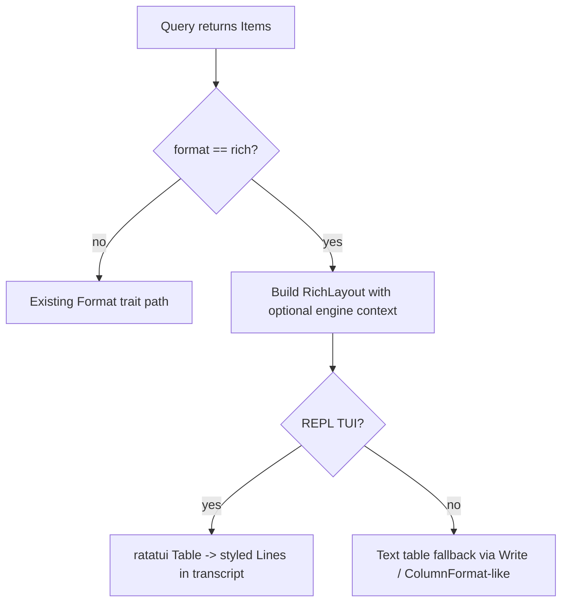

# Implement `rich` query format with ratatui

## Current state

**Query-result `rich` is not implemented.** [`OutputFormat`](rust-impl/crates/dql-output/src/config.rs) only defines `Smart | Column | Expanded | Json`. `from_name("rich")` returns `None`, so `opt format rich` is rejected in [`meta/opt.rs`](rust-impl/crates/dql-cli/src/meta/opt.rs) and persisted config values of `"rich"` silently fall back to `Smart` via `unwrap_or(OutputFormat::Smart)`.

What *does* exist today:

| Piece | Status |
| --- | --- |
| `ratatui` in workspace + REPL shell | Yes — [`repl/app.rs`](rust-impl/crates/dql-cli/src/repl/app.rs) |
| `watch` dashboard (ratatui) | Yes — behind `watch` feature |
| `format_table_detail` “rich detail” for `ls <table>` | Yes — [`table_meta.rs`](rust-impl/crates/dql-output/src/table_meta.rs); this is **table metadata**, not query results |
| Python `RichFormat` for `StatementResult::Items` | Yes — [`dql/output.py`](dql/output.py) |

Python behavior to match (information density, not pixel-identical Rich panels):

- Collect all column names across result items
- Put table/index primary-key columns first (green headers), then alphabetical
- Show up to **15** columns in the main table; overflow columns listed in a second “More columns available” table
- Skip column reordering when the query used an explicit attribute projection
- Non-interactive paths still get readable tabular output (Python prints Rich to stdout/less)



## Design

### 1. Shared layout in `dql-output` (no ratatui dependency)

Add [`formats/rich.rs`](rust-impl/crates/dql-output/src/formats/rich.rs) with layout-only types:

```rust
pub struct RichContext {
    pub important_columns: Vec<String>,
    pub preserve_column_order: bool,
}

pub struct RichLayout {
    pub columns: Vec<RichColumn>,      // displayed cols (max 15 + optional "...")
    pub rows: Vec<Vec<String>>,
    pub overflow_columns: Vec<String>,
}

pub fn build_rich_layout(items: &[Item], ctx: Option<&RichContext>) -> RichLayout;
pub fn rich_layout_to_text(layout: &RichLayout, width: usize) -> String; // non-TUI fallback
```

Logic ported from Python [`RichFormat`](dql/output.py):

- `important_columns` = table PK attrs + index PK attrs (when known)
- Sort: important first (stable PK order), then alphabetical
- Cap at 15 visible columns; remainder in `overflow_columns`
- `preserve_column_order` when explicit projection detected

`RichFormat` implements existing `Format` trait by calling `rich_layout_to_text` (box-drawing / padded columns, green PK headers via plain markers or simple styling is fine for stdout; REPL gets real colors).

### 2. Wire `OutputFormat::Rich`

In [`config.rs`](rust-impl/crates/dql-output/src/config.rs):

- Add `Rich` variant
- `from_name("rich")` / `as_str()`
- `formatter()` returns `RichFormat` for non-TUI paths

Extend [`render_result`](rust-impl/crates/dql-output/src/lib.rs) signature minimally:

```rust
pub fn render_result(
    result: &StatementResult,
    config: &OutputConfig,
    backend: &mut dyn DisplayBackend,
    rich_context: Option<&RichContext>,
) -> io::Result<()>
```

`rich_context` is `None` for meta-commands and tests; column sort falls back to alphabetical (still useful).

### 3. Engine context for PK column ordering

Rust has no `parsed_information` today. Add a small mirror on the engine side:

**Files:** [`dql-engine/src/engine.rs`](rust-impl/crates/dql-engine/src/engine.rs), possibly new `query_context.rs`

After each successful `run(statement)` that touches a table (SELECT/SCAN/QUERY paths):

- Store `LastQueryContext { table: TableMeta, index: Option<IndexMeta>, explicit_projection: bool }`
- Expose `Engine::last_query_context() -> Option<&LastQueryContext>`
- Helper `LastQueryContext::rich_context() -> RichContext`

Populate from the parsed `Statement` tree (table name, index name, projection attrs) + `describe(table)` — same data Python lazily resolves in `parsed_information`.

`FragmentEngine` does not need changes beyond reading through `inner()`.

### 4. REPL: ratatui `Table` widget path

Keep `ratatui` in **`dql-cli` only** (per existing architecture — `dql-output` stays lightweight).

New module [`dql-cli/src/repl/rich_table.rs`](rust-impl/crates/dql-cli/src/repl/rich_table.rs):

```rust
pub fn rich_layout_to_lines(layout: &RichLayout, width: u16) -> Vec<Line<'static>>
```

Implementation approach:

1. Build `ratatui::widgets::Table` with `Row`/`Cell`, green `Style` on important column headers, grey on `...`
2. Render into a scratch `TestBackend` sized to `width` × estimated height (header + rows + optional overflow table)
3. Convert buffer cells → `Vec<Line<'static>>` preserving `Span` styles
4. If overflow columns exist, append a second smaller table titled “More columns available”

Update [`repl/app.rs`](rust-impl/crates/dql-cli/src/repl/app.rs) `handle_submit`:

```rust
if output_config.format == OutputFormat::Rich {
    if let Some(StatementResult::Items(items)) = result {
        let ctx = session.engine.last_query_context().map(|c| c.rich_context());
        let layout = build_rich_layout(items, ctx.as_ref());
        transcript.extend(rich_layout_to_lines(&layout, terminal_width));
        // skip text-buffer render_result for Items
    }
} else {
    render_result(...)?;
}
```

Non-item results (status, affected, schema) still use `render_result`.

### 5. CLI/help/config parity

- [`help.rs`](rust-impl/crates/dql-cli/src/help.rs): `format : (smart|column|expanded|json|rich)` — match [`dql/help.py`](dql/help.py)
- [`meta/opt.rs`](rust-impl/crates/dql-cli/src/meta/opt.rs): already validates via `OutputFormat::from_name`; will work once `Rich` exists
- [`session.rs`](rust-impl/crates/dql-cli/src/session.rs), [`meta/file.rs`](rust-impl/crates/dql-cli/src/meta/file.rs): pass `rich_context` into `render_result`
- No config rename — persisted string stays `"rich"`

### 6. Tests

| Test | Location | Assert |
| --- | --- | --- |
| `from_name("rich")` + formatter smoke | `dql-output` unit test | layout builds, text fallback non-empty |
| Column ordering with PK context | `dql-output` or `dql-engine` | hash/range cols first |
| 16+ columns → overflow table | `dql-output` | `overflow_columns` populated |
| `opt format rich` accepted | `dql-cli` test | set/get round-trip |
| REPL rich rendering | `dql-cli` test using `TestBackend` helper | styled lines contain column headers |
| Help string | existing `test_help_docs` | includes `rich` |

Avoid pixel-identical golden files; assert structure (column order, overflow, PK header styling).

## Out of scope

- Changing `ls` table detail (already done in parity 6)
- Pixel-identical Python Rich panels
- Paging inside ratatui table widget (REPL scrollback handles overflow; `-c` uses text fallback)
- Moving entire REPL to widget-based result panes (keep transcript model)

## Risks

| Risk | Mitigation |
| --- | --- |
| `TestBackend` render height wrong | Over-allocate height (`rows + 4`); trim trailing blank lines |
| `parsed_information` scope creep | Only store fields needed for `RichContext` |
| ratatui + less TTY conflict | Rich fallback path for `-c`; REPL never spawns less for item tables |

## Suggested commit sequence

1. `feat(output): add RichLayout and RichFormat text fallback`
2. `feat(engine): expose last query context for rich column ordering`
3. `feat(cli): render rich format with ratatui Table in REPL`
4. `docs(cli): add rich to format help and parity tests`
