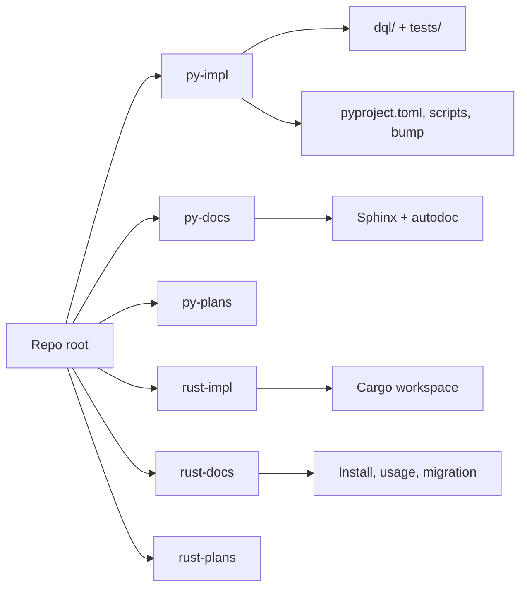

# Segregate Python and Rust implementations

Target layout (same git repo, one checkout):

```
LICENSE
README.md                  # thin index only (Markdown, replaces README.rst)
.github/workflows/         # GitHub requires this location
manual-tests/              # language-agnostic DQL fixtures (unchanged)
py-impl/                   # Python package, tests, packaging, Python tooling
py-docs/                   # existing Sphinx tree (keep .rst)
py-plans/                  # new; Python design plans (README.md)
rust-impl/                 # already exists; maintainer README.md
rust-docs/                 # new; user-facing Markdown
rust-plans/                # already exists; rewrite/architecture todos
```



**Layout decision:** keep these six folders at the repo root. Do **not** nest them under `python/` and `rust/` (for example `python/impl`). Nesting would simplify CI path filters to `python/**` / `rust/**` and give bump/DynamoDB scripts a language-root home, but it adds a directory hop for the usual `cd rust-impl` workflow and was rejected.

**Docs format:** all **new** READMEs and docs are Markdown (`.md`). Do not author new `.rst` files. Existing Sphinx pages under `py-docs/` stay reStructuredText (Sphinx autodoc). Existing `CHANGES.rst` moves with Python packaging and is not converted in this change.

**Commit policy:** never mix `git mv` and content edits in the same commit. Move commits are rename-only (`git mv`, plus `mkdir` for an empty destination). The tree may not build or document correctly until the matching content-edit commit. Do not rewrite `v-next` / `v-rust` into single-impl branches; sibling trees replace that isolation. After the moves, both implementations exist on every branch.

Suggested commit messages (why, not file lists):

- Move py-impl: `Move the Python implementation into py-impl so it no longer owns the repo root.`
- Move py-docs: `Move Sphinx docs into py-docs to sit beside the Python implementation.`
- Move rust-docs: `Move the Python-to-Rust migration guide into rust-docs.`
- py-plans: `Add py-plans for Python-only design notes.`
- Python paths: `Point Python packaging, Sphinx, and bump tooling at py-impl and py-docs.`
- Rust docs split: `Give the Rust client its own user docs and install scripts.`
- Versioning: `Let Python and Rust bump versions independently.`
- CI: `Run Python and Rust CI from path filters instead of v-next/v-rust branches.`
- Thin root: `Replace the mixed root README with a short Markdown index.`

---

## Move phase (rename-only)

### 1. Move Python into `py-impl/`

`mkdir py-impl` then `git mv` from repo root into [`py-impl/`](py-impl/). **Do not edit file contents.**

- Package and tests: `dql/`, `tests/`
- Packaging: `pyproject.toml`, `uv.lock`, `MANIFEST.in`, `CHANGES.rst`
- Tooling: `.python-version`, `.pylintrc`, `.envrc`, `.sdkmanrc`
- Versioning: `.bumpversion.cfg` (leave the rust-impl path in the file; fix later)
- Entire [`scripts/`](scripts/) directory (including `bump-version.sh` still syncing Cargo.lock). Do not strip Rust lockfile logic in this commit. Do not copy scripts into `rust-impl/` yet.

Skip untracked `bin/` (`bin` is gitignored). If `bin/install.py` must be kept, add it under `py-impl/scripts/` in a later content commit.

`module-root = ""` stays valid because `dql/` still sits next to `py-impl/pyproject.toml`.

### 2. Commit `py-impl` move

Stage only the renames. No path rewrites.

### 3. Move Sphinx into `py-docs/`

`git mv doc py-docs`. **Do not** edit `conf.py`, getting started, or develop.

### 4. Commit `py-docs` move

Stage only the rename.

### 5. Move migration guide into `rust-docs/`

`mkdir rust-docs` then `git mv rust-plans/migration-from-python.md rust-docs/`. **Do not** rewrite the guide or split `rust-impl/README.md` yet.

### 6. Commit `rust-docs` move

Stage only the rename.

---

## Change phase (content edits)

### 7. Create `py-plans/`

New top-level folder with `README.md` stating it holds Python-only design plans. Do not relocate [`.cursor/plans/`](.cursor/plans/) (those are Rust rewrite/parity artifacts). Optionally later archive cursor plans into `rust-plans/`. New plan files here are Markdown.

### 8. Commit `py-plans`

### 9. Fix Python paths and Python docs

Content-only (files already in `py-impl/` / `py-docs/`):

- Task paths that assumed repo root (`lint-*` currently includes `bin/install.py`; `bump` / `dynamo` / `test-matrix`)
- `MANIFEST.in` should include `py-impl`’s own `README.md` + `CHANGES.rst`, not the root README
- [`py-docs/conf.py`](doc/conf.py): `sys.path` must insert `../py-impl`; `linkcode_resolve` GitHub URLs must prefix `py-impl/`
- [`py-docs/topics/getting_started.rst`](doc/topics/getting_started.rst): Python install only (`dql` CLI, pip / uv / pex)
- [`py-docs/topics/develop.rst`](doc/topics/develop.rst): drop the “Rust implementation” section; point version bumps at `py-impl` only
- Short [`py-impl/README.md`](py-impl/README.md) (uv setup, taskipy, pointer to `py-docs`)
- Document install-from-git subdirectory:

```text
uv tool install "git+https://github.com/jspreddy/dql.git@<branch>#subdirectory=py-impl"
```

Language query pages (`py-docs/topics/queries/`) stay with Sphinx, per “Sphinx is the Python docs.”

### 10. Commit Python path fixes

### 11. Split Rust user docs vs `rust-impl/`

Leave the Cargo workspace in [`rust-impl/`](rust-impl/). Content-only:

- Write [`rust-docs/`](rust-docs/) user Markdown from the user half of [`rust-impl/README.md`](rust-impl/README.md) (install, connect, flags, statements, SAVE/LOAD) and Rust install bits currently in root [`README.rst`](README.rst). `migration-from-python.md` is already in `rust-docs/` from the move commit; update links only if needed.
- Slim [`rust-impl/README.md`](rust-impl/README.md) to maintainers: crate table, fmt/clippy/test, DynamoDB Local, smoke script, pointer to `rust-docs/`
- Update [`rust-plans/`](rust-plans/) links that still say `doc/` or root `tests/` to `py-docs/` and `py-impl/tests/`
- Copy (not `git mv`) DynamoDB Local + Java helpers from `py-impl/scripts/` into `rust-impl/scripts/` (Rust CI today calls **root** [`scripts/install_dynamodb_local.sh`](scripts/install_dynamodb_local.sh), which already moved). Track `install-rust.sh` under `rust-impl/scripts/` if it should be versioned (not gitignored `bin/`)
- Point `[workspace.package] readme` in [`rust-impl/Cargo.toml`](rust-impl/Cargo.toml) at `rust-impl/README.md` or `../rust-docs/README.md` instead of `../README.rst`

`cargo install --git … -p dql-cli` needs a workspace `Cargo.toml` at the git root; it is already nested. Document `cd rust-impl && cargo install --path crates/dql-cli` (or clone + path). Do not add a root virtual workspace.

### 12. Commit Rust docs split

### 13. Independent versioning

- **Python:** `py-impl/.bumpversion.cfg` updates `py-impl/pyproject.toml`, `py-docs/conf.py`, `py-impl/dql/cli.py`, then `uv lock` only. Strip Cargo lock sync from `py-impl/scripts/bump-version.sh`.
- **Rust:** bump only `rust-impl/Cargo.toml` + regenerate `Cargo.lock` (small `rust-impl/scripts/bump-version.sh`, or cargo-release later). Starting version can remain `0.6.4-dev12` but numbers may diverge.

**Tag namespaces** so independent bumps do not collide. Today [`rust-release.yml`](.github/workflows/rust-release.yml) fires on `[0-9]+.[0-9]+.[0-9]+`. After the split, use `rust-0.6.4` / `python-0.6.4` (or `dqlrs-*` / `dql-*`) and update the release workflow `on.push.tags` filter. Unprefixed `0.6.4` would otherwise build Rust artifacts from a Python tag.

### 14. Commit versioning split

### 15. CI ownership (files stay under `.github/workflows/`)

GitHub Actions cannot live inside `py-impl/` / `rust-impl/`. Own CI by **separate workflows + path filters**, and stop gating on `v-next` vs `v-rust` (both trees will be on the same branch).

- [`code-workflows.yml`](.github/workflows/code-workflows.yml) becomes `python-workflows.yml`; path filter `py-impl/**`, `py-docs/**`, `py-plans/**`, this workflow
- [`rust-workflows.yml`](.github/workflows/rust-workflows.yml) keep name; path filter `rust-impl/**`, `rust-docs/**`, `rust-plans/**`, this workflow
- [`rust-release.yml`](.github/workflows/rust-release.yml) keep; `rust-*` tags; DynamoDB Local via `rust-impl/scripts/`

Python jobs: `working-directory: py-impl` for `uv sync` / `task lint` / `task test`; start Local from `py-impl/scripts/install_dynamodb_local.sh`. Rust Local step: `rust-impl/scripts/…` (drop `working-directory: .` + root script).

Also grep and fix leftover `doc/`, `tests/`, `./scripts/`, and root `pyproject.toml` references in Sphinx, READMEs, rust-plans, and [`rust-impl/scripts/smoke_test.sh`](rust-impl/scripts/smoke_test.sh) if they belong with CI/docs consistency. Do not bulk-edit `.cursor/plans/` unless a link is needed for current work.

Root README CI badge is updated in the thin-root commit, not here.

### 16. Commit CI split

### 17. Thin repo root

Replace [`README.rst`](README.rst) with [`README.md`](README.md) (delete the `.rst`). Short fork note plus links:

- Rust (recommended): `rust-impl/` + `rust-docs/`
- Python (legacy): `py-impl/` + `py-docs/`
- Plans: `rust-plans/`, `py-plans/`
- Both workflow badges (today the root README only points at Python `code-workflows.yml`)

Keep [`LICENSE`](LICENSE) at root (Rust release tarball already copies it).

Slim [`.gitignore`](.gitignore): Python artifacts belong in `py-impl/.gitignore`; `rust-impl/.gitignore` already ignores `target/`. Root keeps editor/OS + optional `.dynamo-local` if anyone still runs Local from repo root.

Leave [`manual-tests/`](manual-tests/) at root (DQL scripts + JSON; not an implementation). [`manual-tests/fake-users/convert.py`](manual-tests/fake-users/convert.py) can stay as an ad-hoc helper.

Delete any leftover root Python config that was not part of the `py-impl` move. Root `scripts/` should already be gone after the move commit.

### 18. Commit thin repo root

---

## Out of scope

- Splitting into two git remotes
- Deleting Python or declaring Rust-only default branch
- Nested language roots (`python/{impl,docs,plans}`, `rust/{impl,docs,plans}`)
- Nested Cargo/uv workspaces at repo root
- Converting existing Sphinx `py-docs/` from RST to Markdown
- Mixing `git mv` and content edits in one commit
- Re-enabling the commented PyPI publish job (update paths if it is revived later)
