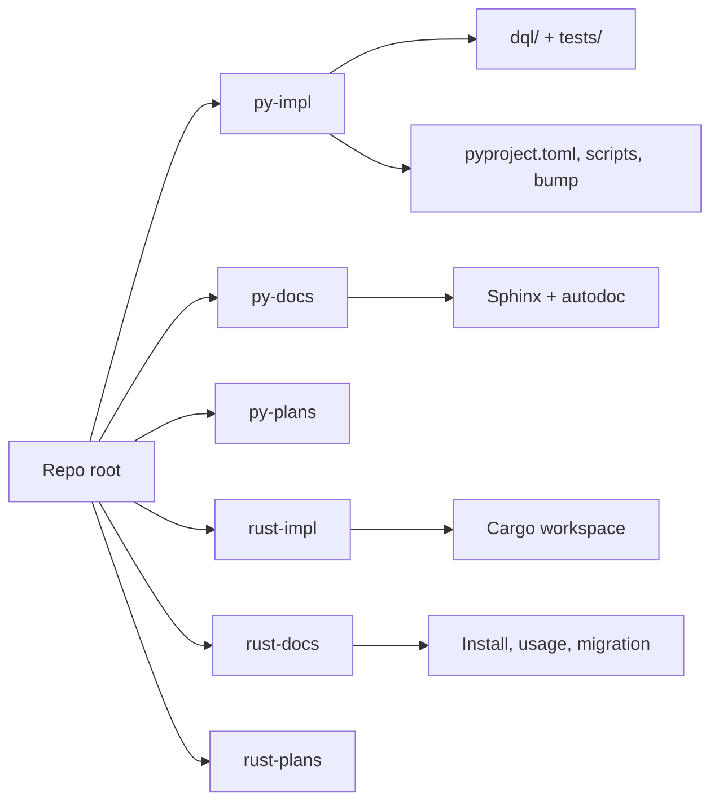

# Segregate Python and Rust implementations

Target layout (same git repo, one checkout):

```
LICENSE
README.md                  # thin index only (Markdown, replaces README.rst)
.github/workflows/         # GitHub requires this location
manual-tests/              # language-agnostic DQL fixtures (unchanged)
py-impl/                   # Python package, tests, packaging, Python tooling
py-docs/                   # existing Sphinx tree (keep .rst)
py-plans/                  # new; Python design plans (README.md)
rust-impl/                 # already exists; maintainer README.md
rust-docs/                 # new; user-facing Markdown
rust-plans/                # already exists; rewrite/architecture todos
```



**Layout decision:** keep these six folders at the repo root. Do **not** nest them under `python/` and `rust/` (for example `python/impl`). Nesting would simplify CI path filters to `python/**` / `rust/**` and give bump/DynamoDB scripts a language-root home, but it adds a directory hop for the usual `cd rust-impl` workflow and was rejected.

**Docs format:** all **new** READMEs and docs are Markdown (`.md`). Do not author new `.rst` files. Existing Sphinx pages under `py-docs/` stay reStructuredText (Sphinx autodoc). Existing `CHANGES.rst` moves with Python packaging and is not converted in this change.

Use `git mv` so history is preserved. Do not rewrite `v-next` / `v-rust` into single-impl branches; sibling trees replace that isolation. After the move, both implementations exist on every branch.

## 1. Move Python into `py-impl/`

From repo root into [`py-impl/`](py-impl/):

- Package and tests: `dql/`, `tests/`
- Packaging: `pyproject.toml`, `uv.lock`, `MANIFEST.in`, `CHANGES.rst`
- Tooling: `.python-version`, `.pylintrc`, `.envrc`, `.sdkmanrc`
- Versioning: `.bumpversion.cfg` (Python-only files list)
- Scripts: `scripts/test-python-versions.sh`, `scripts/bump-version.sh` (strip Cargo lock sync), `scripts/install.sh`, `scripts/install_sdkman_java.sh`, a **copy** of `scripts/install_dynamodb_local.sh`, and `bin/install.py` (currently linted via [pyproject.toml](pyproject.toml) tasks; `bin/` is gitignored at root — track it under `py-impl/scripts/` instead)

Keep `module-root = ""` in `py-impl/pyproject.toml` so `dql/` still sits next to that file.

Fix task paths that assume repo root (`lint-*` currently includes `bin/install.py`; `bump` / `dynamo` / `test-matrix` shell scripts). `MANIFEST.in` should include `py-impl`’s own `README.md` + `CHANGES.rst`, not the root README.

**Install-from-git** currently expects root `pyproject.toml`. Document:

```text
uv tool install "git+https://github.com/jspreddy/dql.git@<branch>#subdirectory=py-impl"
```

## 2. Move Sphinx into `py-docs/`

`git mv doc py-docs`.

Update [`py-docs/conf.py`](doc/conf.py):

- `sys.path` must insert `../py-impl` (today it inserts repo root via `os.pardir`)
- `linkcode_resolve` GitHub URLs must prefix `py-impl/` so source links do not 404

Strip Rust from Python Sphinx:

- [`doc/topics/getting_started.rst`](doc/topics/getting_started.rst): Python install only (`dql` CLI, pip / uv / pex)
- [`doc/topics/develop.rst`](doc/topics/develop.rst): drop the “Rust implementation” section; point version bumps at `py-impl` only

Language query pages (`py-docs/topics/queries/`) stay with Sphinx, per “Sphinx is the Python docs.”

Add a short [`py-impl/README.md`](py-impl/README.md) (uv setup, taskipy, pointer to `py-docs`).

## 3. Create `py-plans/`

New top-level folder with `README.md` stating it holds Python-only design plans. Do not relocate [`.cursor/plans/`](.cursor/plans/) (those are Rust rewrite/parity artifacts). Optionally later archive cursor plans into `rust-plans/`. New plan files here are Markdown.

## 4. Split Rust docs vs `rust-impl/`

Leave the Cargo workspace in [`rust-impl/`](rust-impl/).

Create [`rust-docs/`](rust-docs/) from user-facing Markdown:

- User half of [`rust-impl/README.md`](rust-impl/README.md) (install, connect, flags, statements, SAVE/LOAD)
- Rust install bits currently in root [`README.rst`](README.rst)
- Move [`rust-plans/migration-from-python.md`](rust-plans/migration-from-python.md) here (user-facing)

Leave [`rust-plans/`](rust-plans/) for architecture, testing strategy, roadmap, and `todo_*.md`. Update internal links that still say `doc/` or root `tests/` to `py-docs/` and `py-impl/tests/`.

Slim [`rust-impl/README.md`](rust-impl/README.md) to maintainers: crate table, fmt/clippy/test, DynamoDB Local, smoke script, pointer to `rust-docs/`.

Copy DynamoDB Local + Java helper scripts into `rust-impl/scripts/` (today Rust CI calls **root** [`scripts/install_dynamodb_local.sh`](scripts/install_dynamodb_local.sh)). Track `install-rust.sh` under `rust-impl/scripts/` (not gitignored `bin/`).

Point `[workspace.package] readme` in [`rust-impl/Cargo.toml`](rust-impl/Cargo.toml) at `rust-impl/README.md` or `../rust-docs/README.md` instead of `../README.rst`.

`cargo install --git … -p dql-cli` needs a workspace `Cargo.toml` at the git root; it is already nested. Document `cd rust-impl && cargo install --path crates/dql-cli` (or clone + path). Do not add a root virtual workspace.

## 5. Independent versioning

Delete root [`.bumpversion.cfg`](.bumpversion.cfg) and the dual-lock sync in [`scripts/bump-version.sh`](scripts/bump-version.sh).

- **Python:** `py-impl/.bumpversion.cfg` updates `py-impl/pyproject.toml`, `py-docs/conf.py`, `py-impl/dql/cli.py`, then `uv lock` only. Python bump script lives in `py-impl/scripts/`.
- **Rust:** bump only `rust-impl/Cargo.toml` + regenerate `Cargo.lock` (small `rust-impl/scripts/bump-version.sh`, or cargo-release later). Starting version can remain `0.6.4-dev12` but numbers may diverge.

**Tag namespaces** so independent bumps do not collide. Today [`rust-release.yml`](.github/workflows/rust-release.yml) fires on `[0-9]+.[0-9]+.[0-9]+`. After the split, use `rust-0.6.4` / `python-0.6.4` (or `dqlrs-*` / `dql-*`) and update the release workflow `on.push.tags` filter. Unprefixed `0.6.4` would otherwise build Rust artifacts from a Python tag.

## 6. CI ownership (files stay under `.github/workflows/`)

GitHub Actions cannot live inside `py-impl/` / `rust-impl/`. Own CI by **separate workflows + path filters**, and stop gating on `v-next` vs `v-rust` (both trees will be on the same branch).

| Workflow | Becomes | Path filter |
| --- | --- | --- |
| [`code-workflows.yml`](.github/workflows/code-workflows.yml) | `python-workflows.yml` | `py-impl/**`, `py-docs/**`, `py-plans/**`, this workflow |
| [`rust-workflows.yml`](.github/workflows/rust-workflows.yml) | keep name | `rust-impl/**`, `rust-docs/**`, `rust-plans/**`, this workflow |
| [`rust-release.yml`](.github/workflows/rust-release.yml) | keep | `rust-*` tags; DynamoDB Local via `rust-impl/scripts/` |

Python jobs: `working-directory: py-impl` for `uv sync` / `task lint` / `task test`; start Local from `py-impl/scripts/install_dynamodb_local.sh`. Rust Local step: `rust-impl/scripts/…` (drop `working-directory: .` + root script).

Root README CI badge: show both workflow badges (today it only points at Python `code-workflows.yml`).

## 7. Thin repo root

Replace [`README.rst`](README.rst) with [`README.md`](README.md) (delete the `.rst`). Short fork note plus links:

- Rust (recommended): `rust-impl/` + `rust-docs/`
- Python (legacy): `py-impl/` + `py-docs/`
- Plans: `rust-plans/`, `py-plans/`

Keep [`LICENSE`](LICENSE) at root (Rust release tarball already copies it).

Slim [`.gitignore`](.gitignore): Python artifacts (`.venv`, `uv.lock` is tracked, `__pycache__`, `.coverage`) belong in `py-impl/.gitignore`; `rust-impl/.gitignore` already ignores `target/`. Root keeps editor/OS + optional `.dynamo-local` if anyone still runs Local from repo root.

Leave [`manual-tests/`](manual-tests/) at root (DQL scripts + JSON; not an implementation). [`manual-tests/fake-users/convert.py`](manual-tests/fake-users/convert.py) can stay as an ad-hoc helper.

Delete emptied root `scripts/` after copies exist in both impl trees.

## 8. Path rewrites (non-move)

After `git mv`, grep and fix remaining `doc/`, `tests/`, `./scripts/`, `dql/cli.py`, `pyproject.toml` (root), and `rust-impl` references in:

- Sphinx, READMEs, rust-plans
- Workflows (above)
- [`rust-impl/scripts/smoke_test.sh`](rust-impl/scripts/smoke_test.sh) if it assumes repo-root paths

Do not bulk-edit `.cursor/plans/` unless a link is needed for current work.

## Out of scope

- Splitting into two git remotes
- Deleting Python or declaring Rust-only default branch
- Nested language roots (`python/{impl,docs,plans}`, `rust/{impl,docs,plans}`)
- Nested Cargo/uv workspaces at repo root
- Converting existing Sphinx `py-docs/` from RST to Markdown
- Re-enabling the commented PyPI publish job (update paths if it is revived later)
