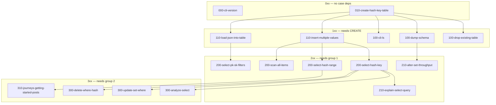

# Case ordering

Harness cases under `cases/<NNN>-<family>-<slug>/` do **not** share DynamoDB
state. Each run gets unique `{{TABLE}}` names, its own `setup.dql`, and
teardown. The numbers below are **diagnostic dependencies**: if an earlier case
fails, a later case that uses that feature in setup or to check its result is
not trustworthy.

`harness/run.sh` runs cases in this order (`LC_ALL=C` sort of folder names).
Pass a numeric group to run a subset; `x` is a digit wildcard:

```bash
./black-box-tests/harness/run.sh 0xx
./black-box-tests/harness/run.sh 1xx
./black-box-tests/harness/run.sh 11x
./black-box-tests/harness/run.sh 2xx
```

## Numbering

The case directory is `<NNN>-<family>-<slug>`. `cli` straddles tiers
(`000-cli-version` has no DQL deps; `100-cli-ls` needs `CREATE`).

| Prefix | Meaning |
| --- | --- |
| `0xx-` | No dependency on other cases. |
| `1xx-` | Depends on the `0` group succeeding. |
| `2xx-` | Depends on the `1` group succeeding. |
| `3xx-` | Depends on the `2` group succeeding. |

`xx` is order **within** that tier. The same three-digit number means the same
group: no order between those cases; they may fail independently of each other.

## How cycles are broken

Several cases **test** one feature and **check** it with another:

| Case | Feature under test | Check / setup that would cycle |
| --- | --- | --- |
| `010-create-hash-key-table` | `CREATE` | `INSERT` + `SELECT` in `input.dql` |
| `110-insert-multiple-values` | `INSERT` | `SELECT` in `input.dql` |
| `110-load-json-into-table` | `LOAD` | `SELECT` in `input.dql` |
| `300-update-set-where` | `UPDATE` | `SELECT` in `input.dql` |
| `300-delete-where-hash` | `DELETE` | `SELECT` in `input.dql` |
| `210-alter-set-throughput` | `ALTER` | `DUMP SCHEMA` in `input.dql` |

A case depends on another case only for the **feature under test** of that other
case, not for statements used only to check the result. So `create` is group `0`
even though its script also inserts and selects. If `create` and `insert` both
fail, believe `create` first.

## Graph



`explain` is in `2xx` because its hard requirement is a table (`CREATE` / group
`0`) plus `INSERT` in setup (group `1`). It is numbered `210` so it sorts after
the `SELECT` cases it explains. `ANALYZE` actually runs `SELECT`, so it sits in
`3xx`.

## Names

| Case | Depends on |
| --- | --- |
| `000-cli-version` | — |
| `010-create-hash-key-table` | — |
| `100-drop-existing-table` | `create` |
| `100-dump-schema` | `create` |
| `100-cli-ls` | `create` |
| `110-insert-multiple-values` | `create` |
| `110-load-json-into-table` | `create` |
| `200-select-hash-key` | `insert` |
| `200-select-hash-range` | `insert` |
| `200-select-pk-sk-filters` | `load` |
| `200-scan-all-items` | `insert` |
| `210-alter-set-throughput` | `dump` |
| `210-explain-select-query` | `insert` (setup); sorts after `SELECT` |
| `300-analyze-select` | `select` |
| `300-update-set-where` | `select` |
| `300-delete-where-hash` | `select` |
| `310-journeys-getting-started-posts` | `create`, `insert`, `200-select-hash-range` |

## Per case

### `000` — `000-cli-version`

- Setup: none. Input: `version`.
- No tables, no DQL statements. First check that the binary runs.

### `010` — `010-create-hash-key-table`

- Input: `CREATE` + `INSERT` + `SELECT`. Expected output: the inserted row.
- Foundation language case. No other case must pass first. Treat insert/select
  here as the check that `CREATE` worked, not as a dependency on those families.

### `100` — `100-drop-existing-table`, `100-dump-schema`, `100-cli-ls`

Same group. Each setup is only `CREATE TABLE`.

| Case | Input | Why after create |
| --- | --- | --- |
| `100-drop-existing-table` | `DROP TABLE` | Table must exist. |
| `100-dump-schema` | `DUMP SCHEMA` | Table must exist. |
| `100-cli-ls` | `ls` | Lists the table created in setup. |

### `110` — `110-insert-multiple-values`, `110-load-json-into-table`

Same group. Write paths after `CREATE`. Neither needs the other. Both use
`SELECT` only to check that the write worked.

| Case | Setup | Input |
| --- | --- | --- |
| `110-insert-multiple-values` | `CREATE` | `INSERT` (multi-row) then `SELECT` |
| `110-load-json-into-table` | `CREATE` + `LOAD seed.json` | `SELECT` |

### `200` — `200-select-hash-key`, `200-select-hash-range`, `200-select-pk-sk-filters`, `200-scan-all-items`

Same group. Read paths after a successful write.

| Case | Setup | Input |
| --- | --- | --- |
| `200-select-hash-key` | `CREATE` + `INSERT` | `SELECT` by hash |
| `200-select-hash-range` | `CREATE` (hash+range) + `INSERT` | `SELECT` by hash and range |
| `200-select-pk-sk-filters` | `CREATE` (hash+range) + `LOAD` 1000 JSON-line rows | `SELECT` by hash, sort-key prefix, and extra filters |
| `200-scan-all-items` | `CREATE` + `INSERT` | `SCAN *` |

`200-select-hash-range` does not need `200-select-hash-key` to pass; both need
`INSERT`. `200-select-pk-sk-filters` uses `LOAD` instead of `INSERT`; the extra
`status` / `region` predicates are FilterExpression (they drop some rows that
match the key condition).

### `210` — `210-alter-set-throughput`, `210-explain-select-query`

Same number: both sit after group `1`, neither needs the other.

| Case | Setup | Input | Depends on |
| --- | --- | --- | --- |
| `210-alter-set-throughput` | `CREATE … THROUGHPUT (1, 1)` | `ALTER SET THROUGHPUT` + `DUMP SCHEMA` | `100-dump-schema` |
| `210-explain-select-query` | `CREATE` + `INSERT` | `EXPLAIN SELECT` (does not run the query) | table from `create` / `insert`; ordered after `SELECT` |

### `300` — `300-analyze-select`, `300-update-set-where`, `300-delete-where-hash`

Same group. Each is only meaningful if `SELECT` already works.

| Case | Setup | Input |
| --- | --- | --- |
| `300-analyze-select` | `CREATE` + `INSERT` | `ANALYZE SELECT` (still returns the item) |
| `300-update-set-where` | `CREATE` + `INSERT` | `UPDATE` then `SELECT` |
| `300-delete-where-hash` | `CREATE` + `INSERT` | `DELETE` then `SELECT` of the remaining row |

### `310` — `310-journeys-getting-started-posts`

Capstone after the focused cases. Setup is `CREATE` with hash, range, LSI, and
throughput, then multi-row `INSERT`. Input is `SELECT` by hash (two of three
rows). Needs `create`, `insert`, and `200-select-hash-range` to be passing; it
does not use `UPDATE` / `DELETE` / `ANALYZE`. `310` rather than `300` so it
sorts after those narrower cases.
