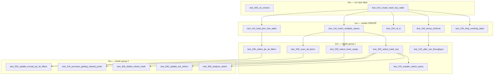

# Test ordering

Black-box tests under `tests/test_<NNN>_*.py` do **not** share DynamoDB state.
Each run gets unique table names (test name, binary, and pytest pid), its own
setup, and teardown. The numbers below are **diagnostic dependencies**: if an
earlier test fails, a later test that uses that feature in setup or to check
its result is not trustworthy.

`run.sh` runs tests in this order (`LC_ALL=C` sort of `test_NNN_*` names).
Pass a numeric group to run a subset; `x` is a digit wildcard:

```bash
./black-box-tests/run.sh 0xx
./black-box-tests/run.sh 1xx
./black-box-tests/run.sh 11x
./black-box-tests/run.sh 2xx
```

## Numbering

The test is `test_<NNN>_<family>_<slug>`. `cli` straddles tiers
(`test_000_cli_version` has no DQL deps; `test_100_cli_ls` needs `CREATE`).

| Prefix | Meaning |
| --- | --- |
| `0xx` | No dependency on other tests. |
| `1xx` | Depends on the `0` group succeeding. |
| `2xx` | Depends on the `1` group succeeding. |
| `3xx` | Depends on the `2` group succeeding. |

`xx` is order **within** that tier. The same three-digit number means the same
group: no order between those tests; they may fail independently of each other.

## How cycles are broken

Several tests **test** one feature and **check** it with another:

| Test | Feature under test | Check / setup that would cycle |
| --- | --- | --- |
| `test_010_create_hash_key_table` | `CREATE` | `INSERT` + `SELECT` in the same `-c` |
| `test_110_insert_multiple_values` | `INSERT` | `SELECT` after the insert |
| `test_110_load_json_into_table` | `LOAD` | `SELECT` after the load |
| `test_300_update_set_where` | `UPDATE` | `SELECT` after the update |
| `test_300_update_except_pk_sk_filters` | `UPDATE` | `SCAN count(*)` + `attribute_exists` |
| `test_300_delete_where_hash` | `DELETE` | `SELECT` of the remaining row |
| `test_210_alter_set_throughput` | `ALTER` | `DUMP SCHEMA` after the alter |

A test depends on another test only for the **feature under test** of that other
test, not for statements used only to check the result. So `create` is group `0`
even though its script also inserts and selects. If `create` and `insert` both
fail, believe `create` first.

## Graph



`explain` is in `2xx` because its hard requirement is a table (`CREATE` / group
`0`) plus `INSERT` in setup (group `1`). It is numbered `210` so it sorts after
the `SELECT` tests it explains. `ANALYZE` actually runs `SELECT`, so it sits in
`3xx`.

## Names

| Test | Depends on |
| --- | --- |
| `test_000_cli_version` | — |
| `test_010_create_hash_key_table` | — |
| `test_100_drop_existing_table` | `create` |
| `test_100_dump_schema` | `create` |
| `test_100_cli_ls` | `create` |
| `test_110_insert_multiple_values` | `create` |
| `test_110_load_json_into_table` | `create` |
| `test_200_select_hash_key` | `insert` |
| `test_200_select_hash_range` | `insert` |
| `test_200_select_pk_sk_filters` | `load` |
| `test_200_scan_all_items` | `insert` |
| `test_210_alter_set_throughput` | `dump` |
| `test_210_explain_select_query` | `insert` (setup); sorts after `SELECT` |
| `test_300_analyze_select` | `select` |
| `test_300_update_set_where` | `select` |
| `test_300_update_except_pk_sk_filters` | `test_200_select_pk_sk_filters`, `scan` |
| `test_300_delete_where_hash` | `select` |
| `test_310_journeys_getting_started_posts` | `create`, `insert`, `test_200_select_hash_range` |

## Per test

### `000` — `test_000_cli_version`

- Setup: none. Test: `version`.
- No tables, no DQL statements. First check that the binary runs.

### `010` — `test_010_create_hash_key_table`

- Test: `CREATE` + `INSERT` + `SELECT`. Expected output: the inserted row.
- Foundation language case. No other test must pass first. Treat insert/select
  here as the check that `CREATE` worked, not as a dependency on those families.

### `100` — drop, dump, ls

Same group. Each setup is only `CREATE TABLE`.

| Test | Test command | Why after create |
| --- | --- | --- |
| `test_100_drop_existing_table` | `DROP TABLE` | Table must exist. |
| `test_100_dump_schema` | `DUMP SCHEMA` | Table must exist. |
| `test_100_cli_ls` | `ls` | Lists the table created in setup. |

### `110` — insert, load

Same group. Write paths after `CREATE`. Neither needs the other. Both use
`SELECT` only to check that the write worked.

| Test | Setup | Asserted command |
| --- | --- | --- |
| `test_110_insert_multiple_values` | `CREATE` | `INSERT` (multi-row) then `SELECT` |
| `test_110_load_json_into_table` | `CREATE` + `LOAD` `fixtures/load-users/seed.json` | `SELECT` |

### `200` — select, scan

Same group. Read paths after a successful write.

| Test | Setup | Asserted command |
| --- | --- | --- |
| `test_200_select_hash_key` | `CREATE` + `INSERT` | `SELECT` by hash |
| `test_200_select_hash_range` | `CREATE` (hash+range) + `INSERT` | `SELECT` by hash and range |
| `test_200_select_pk_sk_filters` | `CREATE` (hash+range) + `LOAD` shared 1000-row fixture | `SELECT` by hash, sort-key prefix, and extra filters |
| `test_200_scan_all_items` | `CREATE` + `INSERT` | `SCAN *` |

`test_200_select_hash_range` does not need `test_200_select_hash_key` to pass;
both need `INSERT`. `test_200_select_pk_sk_filters` uses `LOAD` instead of
`INSERT`; the extra `status` / `region` predicates are FilterExpression (they
drop some rows that match the key condition).

### `210` — alter, explain

Same number: both sit after group `1`, neither needs the other.

| Test | Setup | Asserted command | Depends on |
| --- | --- | --- | --- |
| `test_210_alter_set_throughput` | `CREATE … THROUGHPUT (1, 1)` | `ALTER SET THROUGHPUT` + `DUMP SCHEMA` | `test_100_dump_schema` |
| `test_210_explain_select_query` | `CREATE` + `INSERT` | `EXPLAIN SELECT` (does not run the query) | table from `create` / `insert`; ordered after `SELECT` |

### `300` — analyze, update, delete

Same group. Each is only meaningful if `SELECT` already works.

| Test | Setup | Asserted command |
| --- | --- | --- |
| `test_300_analyze_select` | `CREATE` + `INSERT` | `ANALYZE SELECT` (still returns the item) |
| `test_300_update_set_where` | `CREATE` + `INSERT` | `UPDATE` then `SELECT` |
| `test_300_update_except_pk_sk_filters` | `CREATE` (hash+range) + `LOAD` shared 1000-row fixture | `UPDATE SET patched` except the two filtered rows, then `SCAN count(*)` where `attribute_exists(patched)` (998) |
| `test_300_delete_where_hash` | `CREATE` + `INSERT` | `DELETE` then `SELECT` of the remaining row |

### `310` — `test_310_journeys_getting_started_posts`

Capstone after the focused tests. Setup is `CREATE` with hash, range, LSI, and
throughput, then multi-row `INSERT`. Test is `SELECT` by hash (two of three
rows). Needs `create`, `insert`, and `test_200_select_hash_range` to be passing;
it does not use `UPDATE` / `DELETE` / `ANALYZE`. `310` rather than `300` so it
sorts after those narrower tests.
