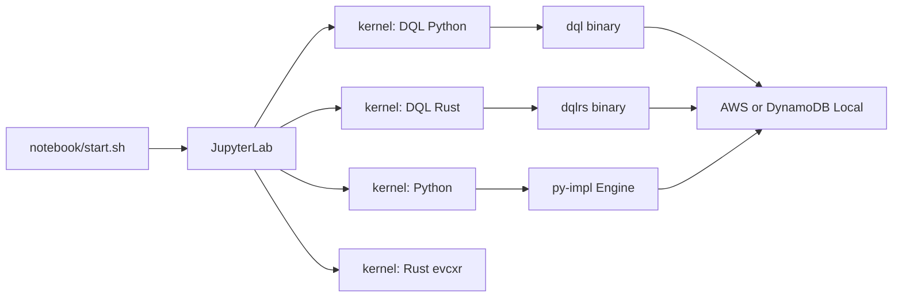

# Plan: notebook frontend for DQL

**Status:** implemented on this branch (v1). evcxr Rust language kernel is still deferred.

**Branch target:** `v-rust` (both Python `dql` and Rust `dqlrs` live here).

## Why this exists

DQL is used as an interactive CLI (`dql` / `dqlrs`). A notebook UI would let people keep queries, explanation, and results in one file, switch between the Python and Rust clients, and share examples without sitting in a REPL.

This repo should not invent a new notebook product. It should install and configure an existing popular open-source notebook interface under a root-level `notebook/` folder, started from the CLI.

## Recommendation

**Use [JupyterLab](https://github.com/jupyterlab/jupyterlab) as the UI.**

Configure it in `notebook/` so the same Lab process can run:

| Kernel | What a cell is | How it talks to DQL |
| --- | --- | --- |
| **DQL (Python)** | DQL statements | Wrapper kernel: cell text → `dql -c` (or in-process `Engine`) |
| **DQL (Rust)** | DQL statements | Wrapper kernel: cell text → `dqlrs -c` |
| **Python** | Python | `ipykernel` + editable `py-impl` (`from dql import Engine`) |
| **Rust** | Rust | [evcxr_jupyter](https://github.com/evcxr/evcxr) (optional, second phase) |

The first two kernels are the product surface: write DQL in cells, pick Python or Rust as the backend. The language kernels are for people who want to mix DQL with Python or Rust code.

Start it from the repo root or from `notebook/`:

```bash
./notebook/start.sh
# or
./notebook/start.sh --no-browser
```

That script owns environment setup, project-local Jupyter config, and `jupyter lab --notebook-dir=notebook`.



## Why JupyterLab (and not the alternatives)

Searched for popular OSS notebook UIs that (1) start from a CLI, (2) can be vendored/configured in-repo, and (3) can target **both** Python and Rust.

| Tool | Why considered | Why not first choice |
| --- | --- | --- |
| **JupyterLab** (~15k GitHub stars, BSD-3, Project Jupyter, v4.6.x) | De-facto notebook UI. Multi-kernel. `jupyter lab` CLI. Project-local config and kernelspecs. uv-friendly. Custom kernels are a documented pattern. | `.ipynb` diffs are noisy (mitigate with nbstripout / keep outputs out of git). |
| [marimo](https://github.com/marimo-team/marimo) | Modern, git-friendly `.py` notebooks, `marimo edit` CLI, first-class SQL cells. | **Python only.** No Rust kernel and no clean way to offer a `dqlrs` cell language. |
| [Apache Zeppelin](https://zeppelin.apache.org/) | Multi-interpreter (Python, SQL, custom). | JVM-heavy, uncommon in Python/Rust repos, awkward to start as a small local tool. |
| [Polynote](https://polynote.org/) | Polyglot (Scala / Python / SQL). | Netflix-oriented, much smaller community, not a fit for DQL + Rust. |
| JupyterLite | Browser-only Jupyter. | No reliable local AWS credentials, DynamoDB Local, or `dqlrs` binary. |
| Custom React / VS Code webview | Full control. | User asked for an existing tool, not a new frontend. |

**JupyterLab is the only widely used OSS notebook that natively supports multiple kernels**, which is the requirement that both `dql` and `dqlrs` show up as first-class backends.

Related pieces we would *configure*, not replace:

- **ipykernel** — Python kernel
- **evcxr_jupyter** — standard Rust Jupyter kernel ([evcxr](https://github.com/evcxr/evcxr), MIT/Apache-2.0)
- **jupyter_client wrapper kernels** — documented way to wrap a CLI as a kernel ([wrapper kernels](https://jupyter-client.readthedocs.io/en/stable/wrapperkernels.html)); same idea as `bash_kernel` / sqlite kernels
- **uv** — already how this repo installs Python tools

## How this maps onto DQL

Both binaries already have a non-interactive path that black-box tests use:

```bash
dql   -H localhost -p 8000 --json -c "SELECT * FROM t WHERE id = 'a';"
dqlrs -H localhost -p 8000 --json -c "SELECT * FROM t WHERE id = 'a';"
```

Shared flags: `-c` / `--command`, `--json`, `-r` / `--region`, `-H` / `--host`, `-p` / `--port`.

Python also exposes a library API (`from dql import Engine`) in `py-impl/`. Rust exposes `dql_engine::Engine` / `FragmentEngine`, but compiling those crates inside evcxr pulls the AWS SDK and is a slow first-cell experience. **Do not use evcxr as the primary way to run DQL.** Use it only if someone wants a Rust scratchpad.

Persistent REPL state is a real constraint:

- Python REPL is `cmd.Cmd` and can be driven, but piping is fragile.
- Rust REPL is a ratatui TUI and is **not** a reliable subprocess for notebooks.
- Therefore DQL kernels should treat each cell as one or more statements via `-c` (or in-process `Engine` for Python), not by attaching to the interactive TUI.

Session-ish settings (`opt`, region, host) come from kernel env / a small config file, not from leftover REPL state.

## Proposed `notebook/` layout (implementation, not this PR)

```text
notebook/
  PLAN.md                 # this document
  README.md               # how to start, kernels, credentials
  pyproject.toml          # uv project: jupyterlab, ipykernel, wrapper-kernel deps
  uv.lock
  jupyter_server_config.py
  start.sh                # CLI entry: sync env, register kernels, launch Lab
  share/jupyter/kernels/  # generated at runtime (gitignored)
  src/dql_notebook_kernel/  # thin wrapper-kernel package
  tests/                  # runner / kernelspec unit tests
  examples/
    getting-started-python.ipynb
    getting-started-rust.ipynb
  .gitignore              # .venv, checkpoints, executed outputs
```

Keep this tree **language-agnostic**, same idea as `black-box-tests/`: it talks to installed `dql` / `dqlrs` binaries and the Python package path, and does not import Rust crate internals.

Root `README.md` maintainer table gets one new row pointing at `notebook/`. No changes to `py-impl/` or `rust-impl/` in the first implementation pass unless a tiny helper is unavoidable.

## CLI start (desired UX)

`notebook/start.sh` (or `scripts/notebook.sh` that execs that file):

1. Require `uv`. Use Python **3.10 or 3.11** (overlap of JupyterLab ≥3.10 and `dql` `requires-python = ">=3.9,<3.12"`).
2. `uv sync` in `notebook/`.
3. Discover `dql` and `dqlrs` on `PATH`, or `DQL_BIN` / `DQLRS_BIN` (same contract as black-box tests). Warn if one is missing; still start Lab if the other exists.
4. Register kernels into `notebook/share/jupyter/kernels` (or `JUPYTER_PATH=notebook`) so we do **not** write user-global kernelspecs.
5. Launch:

```bash
uv run --project notebook jupyter lab \
  --config notebook/jupyter_server_config.py \
  --notebook-dir notebook
```

Config defaults:

- `root_dir` / preferred dir = `notebook/`
- token or localhost-only bind (`127.0.0.1`)
- no remote expose
- open browser unless `--no-browser`

Do **not** add a `dql notebook` / `dqlrs notebook` subcommand in v1. That couples the frontend to both CLIs. A script is enough. A later parity plan can add a thin alias if wanted.

Connection defaults for DQL kernels (overridable):

| Variable | Default | Purpose |
| --- | --- | --- |
| `DQL_BIN` / `DQLRS_BIN` | `dql` / `dqlrs` on `PATH` | Which binary |
| `AWS_REGION` | `us-west-1` (same as CLI) | Region |
| `DQL_HOST` / `DQL_PORT` | unset / `8000` | DynamoDB Local when set |
| `DQL_NOTEBOOK_JSON` | `1` | Prefer `--json` so cells get structured output |

Credentials stay the existing AWS CLI / `aws-vault` story. Example:

```bash
aws-vault exec my-profile -- ./notebook/start.sh
```

## Kernel design

### v1 — DQL wrapper kernels (required)

A small Python wrapper kernel (Jupyter’s documented `ipykernel.kernelbase.Kernel` pattern):

- Cell source is DQL (and DQL meta commands that work with `-c`, e.g. `ls`, `help`).
- `do_execute` runs the selected binary with `-c` and the kernel’s host/region/json flags.
- stdout/stderr become the cell output. `--json` results can be pretty-printed as a table when possible.
- Multi-statement cells: pass the whole cell to `-c` (both CLIs already accept a script).
- Errors: non-zero exit → failed cell, show stderr.

Two kernelspecs, same code, different `argv` / env:

- display name `DQL (Python)` → `DQL_BIN`
- display name `DQL (Rust)` → `DQLRS_BIN`

This is the configuration the user asked for: one notebook UI, two implementations of our tool.

### v1 — Python language kernel (required)

`ipykernel` in the `notebook/` uv env, with `dql` installed as a path dependency on `../py-impl`. Example cells:

```python
from dql import Engine
eng = Engine()
eng.connect(host="localhost", port=8000, region="us-west-1")
eng.execute("SCAN * FROM posts")
```

Optional IPython magics in the same helper package (`%%dql`, `%%dqlrs`) so a Python notebook can call either binary without a dedicated kernel.

### v2 — Rust language kernel (optional)

`cargo install --locked evcxr_jupyter` + `rustup component add rust-src` + `evcxr_jupyter --install` into the project `JUPYTER_PATH`.

Do **not** document `:dep dql-engine = { path = ... }` as the happy path (first compile is large). Rust cells are for general Rust, or for `std::process::Command` calling `dqlrs`.

### Out of scope for v1

- JupyterHub / remote multi-user
- JupyterLite
- Writing a CodeMirror DQL highlighter (SQL mode is enough)
- Changing DQL grammar or CLI flags
- Binding the ratatui REPL into a browser
- CI that boots Jupyter (optional later smoke: `jupyter kernelspec list` after `start.sh --dry-run`)

## Git and repo hygiene

- Commit **unexecuted** example notebooks (no output cells), or strip outputs with nbstripout.
- Ignore `notebook/.venv/`, `notebook/.ipynb_checkpoints/`, and any generated `share/jupyter/` if we materialize it at runtime.
- `notebook/uv.lock` **is** committed (reproducible Lab + kernel deps).
- Example notebooks may hit DynamoDB Local; they are demos, not black-box tests. Do not duplicate `black-box-tests/`.

## Implementation phases

1. **Scaffold** — `notebook/pyproject.toml` (jupyterlab, ipykernel, path-dep `dql`), `start.sh`, server config, gitignore. **Done.**
2. **DQL kernels** — wrapper kernel + `DQL (Python)` / `DQL (Rust)` kernelspecs, env-based binary discovery. **Done.**
3. **Python kernel + examples** — path-dep on `py-impl`, `examples/getting-started-*.ipynb` against DynamoDB Local. **Done.**
4. **Docs pointer** — root `README.md` row + notebook README. **Done.**
5. **Optional leftovers** — evcxr kernel and nbstripout hook are still out of scope. `%%dql` / `%%dqlrs` magics and `start.sh --dry-run` shipped with v1.

v1 also includes `./scripts/notebook.sh` (thin wrapper) and `--local` / `--start-local` on `start.sh`.

## Risks

| Risk | Mitigation |
| --- | --- |
| Python version clash (JupyterLab ≥3.10, dql <3.12) | Pin notebook env to 3.10 or 3.11. |
| Missing `dql` or `dqlrs` | Start Lab anyway; kernel start fails with an install hint. |
| Rust TUI cannot back a kernel | Use `-c` only. |
| evcxr + AWS SDK compile time | Keep evcxr optional; DQL Rust kernel uses the binary. |
| Global Jupyter pollution | Project-local `JUPYTER_PATH` / `--config`; never `jupyter kernelspec install --user` by default. |
| Credentials in notebook output | Examples use Local; README warns not to commit `--json` dumps of real tables. |

## Review questions (resolved by implement)

1. Wrapper kernels (write DQL in cells) **plus** a Python language kernel.
2. `notebook/start.sh` only; no `dql notebook` alias.
3. evcxr waits.
4. Example notebooks target **DynamoDB Local**.
5. Separate uv project under `notebook/`.
