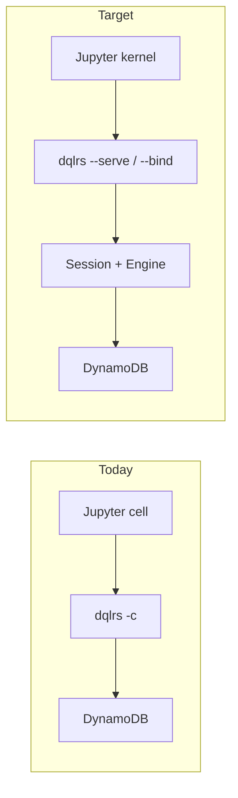

# Plan: headless `dqlrs` worker (`--serve`)

**Status:** implemented in `dql-cli` (`dqlrs --serve` / `--bind`), including
progress events. The DQL (Rust) notebook kernel attaches over stdio `--serve`.

**Consumer:** JupyterLab under `notebook/` (DQL Rust kernel today spawns `dqlrs -c` per cell). This plan is **Rust-only**. A Python `dql --serve` is a later sibling, not a prerequisite.

## Why

Notebooks need a **long-lived DQL session** that is not a TTY:

- `-c` starts a new process every cell. `opt`, `use` / `local`, cached table meta, and in-flight writes do not survive.
- The ratatui REPL cannot back a Jupyter kernel (TUI, no machine protocol).
- `--json` writes one object per item (concatenated), so kernels guess at tables.
- There is no progress channel; stdout is the result stream.

A headless worker is a third front end next to `-c` and the REPL: same `Session` / `FragmentEngine`, no ratatui, JSON-lines on stdio **or** a loopback TCP socket.



This is the Rust half of “continuous evaluation”: one process, many execs, optional progress events. It is **not** a multi-user query farm.

## Current state (`dqlrs`)

| Surface | Role | Notebook fit |
| --- | --- | --- |
| `dql-cli` `run()` | `-c` → `Session::run_command`; else `repl::run_repl` | New branch: `--serve` |
| `Session` | Config, `RuntimeEngine`, throttle, history | Keep; reuse |
| `Session::run_command` | Meta vs DQL, `--json` vs pretty, `less` if TTY | Worker always machine-out |
| `meta::dispatch` | `opt`, `ls`, `use`, `local`, `file`, `help`, … | Most work; refuse TUI-only |
| `StatementResult` | `None` / `Status` / `Affected` / `Items` / `Schema` | Map to envelope |
| `dql-output` `JsonFormat` | NDJSON items | Leave `-c --json` as-is; envelope is serve-only at first |
| `watch` | ratatui + CloudWatch | Error in serve: “not available” |
| `todo_unify_cli_pipelines.md` | One `execute_input` for `-c` and REPL | Worker must call that same function, not a third pipeline |

`run()` today exits 0 even when `run_command` fails (`eprintln` only). Serve must not copy that: errors go in the envelope; the process stays up.

## Goals

1. `dqlrs --serve` keeps one `Session` until shutdown.
2. Client sends DQL or meta text; worker replies with **one JSON value per request**.
3. Same connection flags as today: `-r`, `-H`, `-p`, `AWS_REGION`, `DQL_BACKEND=memory`.
4. No ratatui, no pager, no stdin REPL prompt.
5. Clients drive it over **stdio** (child process) **or** **`--bind` on loopback** (TCP JSON-lines). Both ship in v1.

## Non-goals (v1)

- Python `dql --serve` (document as follow-up).
- Changing `-c --json` wire format (envelope is serve-only until a later shared-JSON plan).
- Multi-client fan-out, auth, TLS, **bind-to-world** (non-loopback).
- Parallel exec on one session (`Engine` is `&mut`).
- Live `watch` dashboard or Rich bars.
- SoS / cross-kernel variable transfer.
- Compiling the engine into evcxr.

## Transport (v1): stdio **and** loopback `--bind`

`--serve` always means “JSON-lines worker, not a TTY.” Where those lines go:

| Invocation | I/O |
| --- | --- |
| `dqlrs --serve` | stdin / stdout (child process; default) |
| `dqlrs --serve --bind 127.0.0.1:7400` | one TCP client at a time, same framing |
| `dqlrs --serve --bind 127.0.0.1:0` | ephemeral port; print `dqlrs serve listen 127.0.0.1:<port>` on **stderr** |

Same protocol on both. `--bind` without `--serve` is an error. `--serve` and `-c` are mutually exclusive. `--json` is implied (ignore or reject if passed).

### `--bind` rules

- Accept `HOST:PORT` (`127.0.0.1:7400`, `[::1]:7400`, `localhost:7400`).
- Also accept `--bind 7400` as `127.0.0.1:7400`.
- **Refuse** any bind address that is not loopback (`127.0.0.1`, `::1`, `localhost` resolving to those). Exit non-zero before listen.
- **One client at a time.** While a connection is open, additional accepts wait or are refused (prefer **refuse** with a one-line stderr note). After the client disconnects, accept the next.
- Disconnect = end of that client’s session **views** only; the `Session` / engine **stay** in the process until `shutdown` or SIGTERM. (So a notebook kernel can reconnect. Review if you instead want disconnect = process exit.)
- No TLS, no token in v1. Loopback is the access control.
- Do not print protocol lines on stderr; only listen address, refuse-non-loopback, and panics.

Stdio remains for tests and embedding. `--bind` is for a notebook kernel (or other tool) that should not multiplex Jupyter ZMQ with DQL on the same pipes.

## Protocol

Line-delimited JSON. Unknown fields ignored. `id` is echoed so the client can match events.

### Client → worker

```json
{"id": "1", "op": "exec", "dql": "SELECT * FROM t WHERE id = 'a';"}
{"id": "2", "op": "ping"}
{"id": "3", "op": "shutdown"}
```

| `op` | Meaning |
| --- | --- |
| `exec` | Run `dql` as one `-c`-style script (complete statements; trailing `;` auto-closed like today). |
| `ping` | Liveness; no engine call. |
| `shutdown` | Finish in-flight exec, then exit 0. |
| `interrupt` | v1: best-effort. If no in-flight work, no-op. Do **not** promise to kill AWS SDK calls in v1. |

No `op` for raw bytes or multiple statements as separate transactions beyond what `execute` already does in one script.

### Worker → client

Success:

```json
{
  "id": "1",
  "ok": true,
  "kind": "items",
  "items": [{"id": "a"}],
  "affected": null,
  "message": null,
  "partial": false
}
```

| `kind` | From `StatementResult` / meta |
| --- | --- |
| `none` | empty / no display |
| `items` | `Items` — **JSON array**, not NDJSON |
| `affected` | `Affected` — `affected` is the count |
| `status` | `Status` — `message` is the text |
| `schema` | `Schema` — `message` is the DUMP text (string is enough for v1) |
| `text` | meta that is only prose today (`help`, `whoami`, `opt` listing) |

Error (process stays up):

```json
{
  "id": "1",
  "ok": false,
  "kind": "error",
  "error": {"code": "parse", "message": "..."}
}
```

`code`: `parse` | `runtime` | `unsupported` | `protocol`.

Progress (INSERT / LOAD / UPDATE / DELETE / paged reads):

```json
{"id": "1", "event": "progress", "done": 200, "total": 1000, "phase": "write"}
```

Clients that do not understand `event` ignore lines without `ok`.

### Framing rules

- One request at a time. A second `exec` before the first `ok`/`error` is a protocol error (or queued — pick **reject** in v1, simpler).
- Incomplete JSON line: wait for newline. Invalid JSON: reply `ok: false` with `id` of `null` if unparsable.
- Empty `exec.dql`: success `kind: none`.
- UTF-8 only.

## Session behavior

Reuse `Session::new` from the same CLI flags. All `exec` lines share that session.

**Supported in serve (must work):** DQL statements that already work with `-c`; meta `opt`, `ls`, `use`, `local`, `file`, `help`, `version`, `whoami` / `iam`, `throttle` / `unthrottle`, `history` (optional).

**Unsupported (return `unsupported`, do not crash):** `watch`, `clear` / `cls` / `c`, `exit` / `quit` (use `op: shutdown`), `shell`.

`use` / `local` are the point of a long-lived worker: later notebook cells must see the new endpoint.

History: append exec text like `-c` does or skip file history in serve (prefer **skip** `~/.dql_history` so a kernel does not pollute the interactive file). Review question.

## Code shape

Do not add a third execution path. Prefer a thin slice of [`todo_unify_cli_pipelines.md`](todo_unify_cli_pipelines.md):

```text
Session::execute_input(line, ExecutionContext) -> ExecutionOutcome
```

- `-c` and REPL keep current user-visible behavior.
- Serve uses `ExecutionContext { machine: true }` → envelope, never `less`, never ratatui.

If unify is too large to land first, v1 may call `run_command` with an internal `Write` buffer and wrap the buffer / `StatementResult` in an envelope. That is acceptable **only** if serve tests lock the envelope; plan a follow-up to delete the buffer hack.

New files (target):

```text
rust-impl/crates/dql-cli/src/serve/mod.rs
rust-impl/crates/dql-cli/src/serve/protocol.rs
rust-impl/crates/dql-cli/src/serve/stdio.rs
rust-impl/crates/dql-cli/src/serve/tcp.rs
```

`args.rs`: `--serve`, `--bind <ADDR>`. `KNOWN_FLAGS` and `help_text()` updated. `lib.rs` `run()`:

```text
if args.serve { serve::run(session, args.bind) } else if command { ... } else { repl }
```

One `serve::run_framed(reader, writer, session)` used by both stdio and TCP. Do not duplicate the exec loop.

Envelope mapping lives in `dql-cli` (or a small `dql-output` helper). Do not teach `dql-engine` about JSON-lines.

## CLI UX

```bash
dqlrs --serve
dqlrs --serve -H localhost -p 8000
dqlrs --serve --bind 127.0.0.1:7400
dqlrs --serve --bind 127.0.0.1:0
```

Help blurb: “Headless JSON-lines worker (stdio, or --bind on loopback). Not a TTY REPL.”

Env unchanged: `AWS_REGION`, `DQL_BACKEND=memory`, dummy keys for Local.

## Testing

All of this is `dql-cli` tests plus one binary smoke. Do not import notebook code.

1. **Protocol unit tests** — encode/decode, `StatementResult` → envelope, unknown `op`, bad JSON.
2. **Serve loop (memory, stdio)** — spawn or call `serve::run` on a pipe: `ping`, `CREATE`+`INSERT`+`SELECT`, `opt`, `ls`, `unsupported` for `watch`, `shutdown`.
3. **Serve loop (memory, `--bind`)** — listen on `127.0.0.1:0`, connect, same script; refuse `--bind 0.0.0.0:1`.
4. **Local (optional)** — `-H` + `--serve` + `SELECT` (stdio or bind).
5. **`package_smoke`** — `--help` mentions `--serve` and `--bind`; `--serve` + `-c` fails to start.
6. **Black-box** — optional later; crate tests that spawn the binary are enough for v1.

Do not require Jupyter in Rust CI.

## Implementation phases

1. **Flags + stub** — `--serve` (stdio) and `--serve --bind`; `ping` / `shutdown`; reject `-c` combo and non-loopback bind. Commit.
2. **Envelope** — map `StatementResult` + `EngineError` to JSON; unit tests. Commit.
3. **Exec on Session** — `op: exec` through the same session as `-c` (memory). Meta allow/deny list. Commit.
4. **Shared framed loop** — one-at-a-time, protocol errors, no history file; stdio and TCP both call it. Commit.
5. **Bind tests** — ephemeral port, second-client refuse, `0.0.0.0` rejected. Commit.
6. **Local smoke** — optional test when port 8000 is up. Commit.
7. **Docs** — `rust-docs/README.md` + `dqlrs --help`. Commit.
8. **Notebook attach** — DQL (Rust) kernel and `%%dqlrs` use stdio `--serve`
   and render progress HTML. Python cells use `DQL_PROGRESS_JSON` on `dql -c`.

Each phase is its own commit.

## Risks

| Risk | Mitigation |
| --- | --- |
| Third execution pipeline | Route through `Session`; unify if serve exposes `-c`/REPL drift |
| Large `Items` JSON | Same as `-c --json`; no pagination in v1 |
| Interrupt / AWS SDK | Document as unsupported in v1 |
| Accidental public bind | Refuse non-loopback **before** listen; tests for `0.0.0.0` |
| Second TCP client | One at a time; refuse extras while busy |
| History / config side effects | Serve does not write `~/.dql_history` |
| Python parity pressure | Protocol is new; Python may implement later, same schema |

## Review questions

1. **`--bind` in v1 — decided.** Stdio remains the default; `--bind` is loopback TCP, same protocol.
2. Is a serve-only JSON envelope OK, or should `-c --json` switch to the same object in the same change?
3. Skip `~/.dql_history` in serve (recommended)?
4. Reject overlapping `exec` (recommended) vs queue?
5. On TCP disconnect: keep the process + `Session` (recommended) or exit?
6. Should notebook attach be a second PR immediately after serve, or wait?
