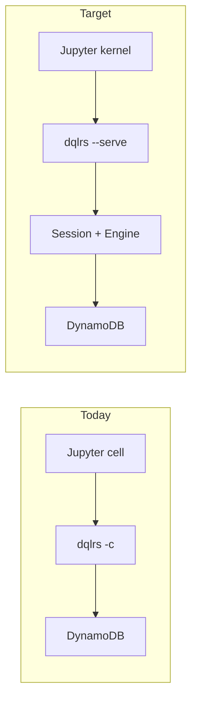

# Plan: headless `dqlrs` worker (`--serve`)

**Status:** plan only. Review before implementation.

**Consumer:** JupyterLab under `notebook/` (DQL Rust kernel today spawns `dqlrs -c` per cell). This plan is **Rust-only**. A Python `dql --serve` is a later sibling, not a prerequisite.

## Why

Notebooks need a **long-lived DQL session** that is not a TTY:

- `-c` starts a new process every cell. `opt`, `use` / `local`, cached table meta, and in-flight writes do not survive.
- The ratatui REPL cannot back a Jupyter kernel (TUI, no machine protocol).
- `--json` writes one object per item (concatenated), so kernels guess at tables.
- There is no progress channel; stdout is the result stream.

A headless worker is a third front end next to `-c` and the REPL: same `Session` / `FragmentEngine`, no ratatui, JSON-lines on a pipe.



This is the Rust half of “continuous evaluation”: one process, many execs, optional progress events. It is **not** a multi-user query farm.

## Current state (`dqlrs`)

| Surface | Role | Notebook fit |
| --- | --- | --- |
| `dql-cli` `run()` | `-c` → `Session::run_command`; else `repl::run_repl` | New branch: `--serve` |
| `Session` | Config, `RuntimeEngine`, throttle, history | Keep; reuse |
| `Session::run_command` | Meta vs DQL, `--json` vs pretty, `less` if TTY | Worker always machine-out |
| `meta::dispatch` | `opt`, `ls`, `use`, `local`, `file`, `help`, … | Most work; refuse TUI-only |
| `StatementResult` | `None` / `Status` / `Affected` / `Items` / `Schema` | Map to envelope |
| `dql-output` `JsonFormat` | NDJSON items | Leave `-c --json` as-is; envelope is serve-only at first |
| `watch` | ratatui + CloudWatch | Error in serve: “not available” |
| `todo_unify_cli_pipelines.md` | One `execute_input` for `-c` and REPL | Worker must call that same function, not a third pipeline |

`run()` today exits 0 even when `run_command` fails (`eprintln` only). Serve must not copy that: errors go in the envelope; the process stays up.

## Goals

1. `dqlrs --serve` keeps one `Session` until shutdown.
2. Client sends DQL or meta text; worker replies with **one JSON value per request**.
3. Same connection flags as today: `-r`, `-H`, `-p`, `AWS_REGION`, `DQL_BACKEND=memory`.
4. No ratatui, no pager, no stdin REPL prompt.
5. Notebook (and tests) can drive it as a child process with no extra ports in v1.

## Non-goals (v1)

- Python `dql --serve` (document as follow-up).
- Changing `-c --json` wire format (envelope is serve-only until a later shared-JSON plan).
- Multi-client fan-out, auth, TLS, bind-to-world.
- Parallel exec on one session (`Engine` is `&mut`).
- Live `watch` dashboard or Rich bars.
- SoS / cross-kernel variable transfer.
- `dqlrs notebook` subcommand.
- Compiling the engine into evcxr.

## Transport (v1): stdio JSON-lines

Primary mode is a **child process**:

```bash
dqlrs --serve -H localhost -p 8000 -r us-west-1
```

- stdin: one JSON object per line (request)
- stdout: one JSON object per line (result or event)
- stderr: human diagnostics only (start log, panic). Not the protocol.

Why stdio first:

- Jupyter already owns the subprocess (same as a kernel).
- No port races, no leftover listeners, no dummy auth.
- Tests spawn the binary and write lines.

**v1.1 (optional in the same plan, later commit):** `--bind 127.0.0.1:PORT` (or `:0` + print the port on stderr). Same framing, one client at a time. Refuse non-loopback unless a future flag says otherwise.

`--serve` and `-c` are mutually exclusive. `--json` is implied by serve (ignore or reject if passed).

## Protocol

Line-delimited JSON. Unknown fields ignored. `id` is echoed so the client can match events.

### Client → worker

```json
{"id": "1", "op": "exec", "dql": "SELECT * FROM t WHERE id = 'a';"}
{"id": "2", "op": "ping"}
{"id": "3", "op": "shutdown"}
```

| `op` | Meaning |
| --- | --- |
| `exec` | Run `dql` as one `-c`-style script (complete statements; trailing `;` auto-closed like today). |
| `ping` | Liveness; no engine call. |
| `shutdown` | Finish in-flight exec, then exit 0. |
| `interrupt` | v1: best-effort. If no in-flight work, no-op. Do **not** promise to kill AWS SDK calls in v1. |

No `op` for raw bytes or multiple statements as separate transactions beyond what `execute` already does in one script.

### Worker → client

Success:

```json
{
  "id": "1",
  "ok": true,
  "kind": "items",
  "items": [{"id": "a"}],
  "affected": null,
  "message": null,
  "partial": false
}
```

| `kind` | From `StatementResult` / meta |
| --- | --- |
| `none` | empty / no display |
| `items` | `Items` — **JSON array**, not NDJSON |
| `affected` | `Affected` — `affected` is the count |
| `status` | `Status` — `message` is the text |
| `schema` | `Schema` — `message` is the DUMP text (string is enough for v1) |
| `text` | meta that is only prose today (`help`, `whoami`, `opt` listing) |

Error (process stays up):

```json
{
  "id": "1",
  "ok": false,
  "kind": "error",
  "error": {"code": "parse", "message": "..."}
}
```

`code`: `parse` | `runtime` | `unsupported` | `protocol`.

Progress (v1.1, only if an exec is running; can ship empty in v1):

```json
{"id": "1", "event": "progress", "done": 200, "total": 1000, "phase": "write"}
```

Clients that do not understand `event` ignore lines without `ok`.

### Framing rules

- One request at a time. A second `exec` before the first `ok`/`error` is a protocol error (or queued — pick **reject** in v1, simpler).
- Incomplete JSON line: wait for newline. Invalid JSON: reply `ok: false` with `id` of `null` if unparsable.
- Empty `exec.dql`: success `kind: none`.
- UTF-8 only.

## Session behavior

Reuse `Session::new` from the same CLI flags. All `exec` lines share that session.

**Supported in serve (must work):** DQL statements that already work with `-c`; meta `opt`, `ls`, `use`, `local`, `file`, `help`, `version`, `whoami` / `iam`, `throttle` / `unthrottle`, `history` (optional).

**Unsupported (return `unsupported`, do not crash):** `watch`, `clear` / `cls` / `c`, `exit` / `quit` (use `op: shutdown`), `shell`.

`use` / `local` are the point of a long-lived worker: later notebook cells must see the new endpoint.

History: append exec text like `-c` does or skip file history in serve (prefer **skip** `~/.dql_history` so a kernel does not pollute the interactive file). Review question.

## Code shape

Do not add a third execution path. Prefer a thin slice of [`todo_unify_cli_pipelines.md`](todo_unify_cli_pipelines.md):

```text
Session::execute_input(line, ExecutionContext) -> ExecutionOutcome
```

- `-c` and REPL keep current user-visible behavior.
- Serve uses `ExecutionContext { machine: true }` → envelope, never `less`, never ratatui.

If unify is too large to land first, v1 may call `run_command` with an internal `Write` buffer and wrap the buffer / `StatementResult` in an envelope. That is acceptable **only** if serve tests lock the envelope; plan a follow-up to delete the buffer hack.

New files (target):

```text
rust-impl/crates/dql-cli/src/serve/mod.rs
rust-impl/crates/dql-cli/src/serve/protocol.rs
```

`args.rs`: `--serve`. `KNOWN_FLAGS` and `help_text()` updated. `lib.rs` `run()`:

```text
if args.serve { serve::run(session) } else if command { ... } else { repl }
```

Envelope mapping lives in `dql-cli` (or a small `dql-output` helper). Do not teach `dql-engine` about JSON-lines.

## CLI UX

```bash
dqlrs --serve
dqlrs --serve -H localhost -p 8000
dqlrs --serve --bind 127.0.0.1:7400    # v1.1
```

Help blurb: “Headless JSON-lines worker (stdin/stdout). Not a TTY REPL.”

Env unchanged: `AWS_REGION`, `DQL_BACKEND=memory`, dummy keys for Local.

## Testing

All of this is `dql-cli` tests plus one binary smoke. Do not import notebook code.

1. **Protocol unit tests** — encode/decode, `StatementResult` → envelope, unknown `op`, bad JSON.
2. **Serve loop (memory)** — spawn or call `serve::run` on a `Cursor`/pipe: `ping`, `CREATE`+`INSERT`+`SELECT`, `opt`, `ls`, `unsupported` for `watch`, `shutdown`.
3. **Local (optional, same as other CLI tests)** — `-H` + `--serve` + `SELECT`.
4. **`package_smoke`** — `dqlrs --help` mentions `--serve`; `--serve` + `-c` fails to start.
5. **Black-box** — optional later case; not required for v1 if crate tests spawn the binary.

Do not require Jupyter in Rust CI.

## Implementation phases

1. **Flags + stub** — `--serve` starts, reads stdin, replies to `ping` / `shutdown`, rejects `-c`. Commit.
2. **Envelope** — map `StatementResult` + `EngineError` to JSON; unit tests. Commit.
3. **Exec on Session** — `op: exec` through the same session as `-c` (memory). Meta allow/deny list. Commit.
4. **Loop polish** — one-at-a-time, protocol errors, no history file. Commit.
5. **Local smoke** — optional test when port 8000 is up. Commit.
6. **Docs** — `rust-docs/README.md` + `dqlrs --help`. Commit.
7. **v1.1** — `--bind 127.0.0.1`, progress events (only if INSERT/LOAD/UPDATE grow counters). Separate commits.
8. **Notebook attach** — out of this crate; follow-up in `notebook/` to keep a worker per DQL (Rust) kernel instead of `-c`. Do not block serve on Lab.

Each phase is its own commit.

## Risks

| Risk | Mitigation |
| --- | --- |
| Third execution pipeline | Route through `Session`; unify if serve exposes `-c`/REPL drift |
| Large `Items` JSON | Same as `-c --json`; no pagination in v1 |
| Interrupt / AWS SDK | Document as unsupported in v1 |
| Accidental public bind | v1 stdio only; v1.1 loopback-only |
| History / config side effects | Serve does not write `~/.dql_history` |
| Python parity pressure | Protocol is new; Python may implement later, same schema |

## Review questions

1. Stdio-only for v1, or `--bind` in the first implementation pass?
2. Is a serve-only JSON envelope OK, or should `-c --json` switch to the same object in the same change?
3. Skip `~/.dql_history` in serve (recommended)?
4. Reject overlapping `exec` (recommended) vs queue?
5. Should notebook attach be a second PR immediately after serve, or wait?
